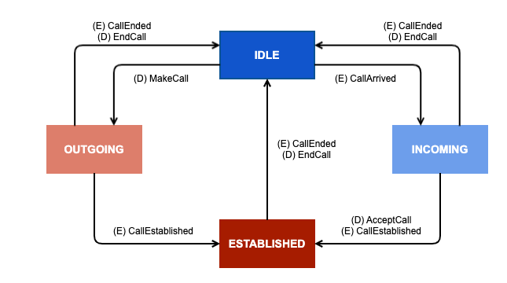

# PhoneCall

## Version

최신 버전은 1.3 입니다.

| Version | Date       | Description                                                                                                                                                                               |
|:--------|:-----------|:------------------------------------------------------------------------------------------------------------------------------------------------------------------------------------------|
| 1.0     | 2020.07.06 | 규격 추가                                                                                                                                                                                     |
| 1.1     | 2020.08.28 | SendCandidates directive 에 clientSearchTargetList 추가                                                                                                                                      |
| 1.2     | 2020.11.02 | Context 에 searchScene 추가<br/>SendCandidates directive 에 searchScene 추가<br/>SendCandidates directive 의 clientSearchTargetList 삭제<br/>Context 에 recipient 추가<br/>MakeCallSucceeded event 추가 |
| 1.3     | 2022.02.15 | Context,SendCandidates intent에 "SAVE_CONTACT", "BLOCK", "EXACT_ONE" 추가<br/>Contact Object 에 isBlocked 추가<br/>Person Object에 poiId 추가<br/>BlockNumber 디렉티브 추가                              |

## State Diagram



## SDK Interface

### PhoneCallAgent 사용

PhoneCall interface 규격에 따른 디바이스의 동작 제어는 PhoneCallAgent 가 처리합니다.



NuguAndroidClient 생성시 PhoneCallAgent 를 추가합니다.


```kotlin
class MyPhoneCallClient: PhoneCallClient {
    ...
}
NuguAndroidClient().Builder()
            .addAgentFactory(PhoneCallAgent.NAMESPACE, object : AgentFactory<PhoneCallAgent> {
                override fun create(container: SdkContainer): PhoneCallAgent = with(container) {
                    PhoneCallAgent(
                        MyPhoneCallClient(),
                        getContextManager(),
                        getMessageSender(),
                        getAudioSeamlessFocusManager(),
                        DefaultFocusChannel.COMMUNICATIONS_CHANNEL_NAME,
                        getDirectiveSequencer(),
                        getInteractionControlManager()
                    )
                }
            })
```


NuguAndroidClient instance 를 통해 PhoneCallAgent instance 에 접근할 수 있습니다.


```kotlin
val phoneCallAgent = nuguAndroidClient.getAgent(PhoneCallAgent.NAMESPACE)
```




NuguClient instance 를 통해 PhoneCallAgent instance 에 접근할 수 있습니다.


```swift
let phoneCallAgent = nuguClient.phoneCallAgent
```




[CapabilityFactory::makeCapability](https://nugu-developers.github.io/nugu-linux/classNuguCapability_1_1CapabilityFactory.html#a46d96b1bc96903f02905c92ba8794bf6) 함수로 [PhoneCallAgent](https://nugu-developers.github.io/nugu-linux/classNuguCapability_1_1IPhoneCallHandler.html) 를 생성하고 [NuguClient](https://nugu-developers.github.io/nugu-linux/classNuguClientKit_1_1NuguClient.html) 에 추가해 주어야합니다.


```cpp
auto phonecall_handler(std::shared_ptr<IPhoneCallHandler>(
        CapabilityFactory::makeCapability<PhoneCallAgent, IPhoneCallHandler>()));

nugu_client->getCapabilityBuilder()
    ->add(phonecall_handler.get())
    ->construct();
```




### Context 구성

통화 상태 정보를 [Context](#context) 에 포함시켜 주어야 합니다.



PhoneCallClient 를 구현합니다.


```kotlin
class MyPhoneCallClient: PhoneCallClient {
    override fun getContext(): Context {
        ...
    }

    ...
}
```




PhoneCallAgentDelegate 를 추가합니다.


```swift
class MyPhoneCallAgentDelegate: PhoneCallAgentDelegate {
    func phoneCallAgentRequestContext() -> PhoneCallContext {
        ...
    }

    ...
}
phoneCallAgent.delegate = self
```




### 발신

전화 발신이 [SendCandidates](#sendcandidates), [MakeCall](#makecall) directive 로 요청될 수 있습니다.



PhoneCallClient 를 구현합니다.


```kotlin
class MyPhoneCallClient: PhoneCallClient {
    override fun sendCandidates(payload: SendCandidatesPayload, callback: Callback) {
        // 연락처 검색 기능을 구현
        ...
    }

    override fun makeCall(payload: MakeCallPayload, callback: Callback) {
        // 전화 발신 기능을 구현
        ...
    }
    ...
}
```




PhoneCallAgentDelegate 를 추가합니다


```swift
class MyPhoneCallAgentDelegate: PhoneCallAgentDelegate {
    func phoneCallAgentDidReceiveSendCandidates(item: PhoneCallCandidatesItem, dialogRequestId: String) {
        // 연락처 검색 기능을 구현
        ...
    }

    func phoneCallAgentDidReceiveMakeCall(callType: PhoneCallType, recipient: PhoneCallPerson, dialogRequestId: String) -> PhoneCallErrorCode? {
        // 전화 발신 기능을 구현
        ...
    }

    ...
}
phoneCallAgent.delegate = self
```




[IPhoneCallListener](https://nugu-developers.github.io/nugu-linux/classNuguCapability_1_1IPhoneCallListener.html) 를 추가합니다.


```cpp
class MyPhoneCallListener : public IPhoneCallListener {
public:
    ...

    void processSendCandidates(const std::string& payload) override
    {
        ...
    }
    
    void processMakeCall(const std::string& payload) override
    {
        ...
    }

    ...
};
auto phonecall_listener(std::make_shared<MyPhoneCallListener>());
CapabilityFactory::makeCapability<PhoneCallAgent, IPhoneCallHandler>(phonecall_listener.get());
```




### 수신

수신 전화에 대한 수락이 [AcceptCall](#acceptcall) directive 로 거절이 [EndCall](#endcall) directive 로 요청될 수 있습니다.


iOS 는 수신 수락/거절 기능을 제공하지 않습니다.




PhoneCallClient 를 구현합니다.


```kotlin
class MyPhoneCallClient: PhoneCallClient {
    override fun acceptCall(payload: AcceptCallPayload) {
        // 수신 수락 기능을 구현
        ...
    }

    override fun makeCall(payload: MakeCallPayload, callback: Callback) {
        // 수신 거절 기능을 구현
        ...
    }
    ...
}
```




[IPhoneCallListener](https://nugu-developers.github.io/nugu-linux/classNuguCapability_1_1IPhoneCallListener.html) 를 추가합니다.


```cpp
class MyPhoneCallListener : public IPhoneCallListener {
public:
    ...

    void processAcceptCall(const std::string& payload)
    {
        ...
    }
    
    ...
};
auto phonecall_listener(std::make_shared<MyPhoneCallListener>());
CapabilityFactory::makeCapability<PhoneCallAgent, IPhoneCallHandler>(phonecall_listener.get());
```




## Context


```json
{
  "PhoneCall": {
    "version": "1.1",
    "state": "{{STRING}}",
    "template": {
      "intent": "{{STRING}}",
      "callType": "{{STRING}}",
      "recipientIntended": {
        "name": "{{STRING}}",
        "label": "{{STRING}}"
      },
      "searchScene": "{{STRING}}",
      "candidates": [Person]
    },
    "recipient": {
        "name": "{{STRING}}",
        "token": "{{STRING}}",
        "isMobile": "{{STRING}}",
        "isRecentMissed": "{{STRING}}"
    },
    "numberBlockable": "{{STRING}}"
  }
}
```


| parameter                       | type                       | mandatory | description                                                                                                                                                                                                                                                                        |
|:--------------------------------|:---------------------------|:----------|:-----------------------------------------------------------------------------------------------------------------------------------------------------------------------------------------------------------------------------------------------------------------------------------|
| state                           | string                     | Y         | **IDLE**<br/>**OUTGOING**<br/>**INCOMING**<br/>**ESTABLISHED**                                                                                                                                                                                                                     |
| template                        | object                     | N         | Play 에서 진행중인 intent 를 알 수 있도록 SendCandidates event 에서 전달받은 data 를 유지해야 함                                                                                                                                                                                                           |
| template.intent                 | string                     | N         | candidates의 용도<br/>- **CALL** : 전화걸어줘<br/>- **SEARCH** : 찾아줘<br/>- **HISTORY** : 최근 통화 목록<br/>- **REDIAL** : 재발신<br/>- **MISSED** : 부재중통화<br/>- **EXACT_ONE** : 전화추천 (전달된 candidates에 새로운 수신자 후보를 추가하지 않고 동명이 있을 경우 하나만 전달)<br/>- **SAVE_CONTACT**<br/>- **BLOCK**<br/>- **NONE**  |
| template.callType               | string                     | N         | **NORMAL** : 일반 전화<br/>**SPEAKER** : 스피커폰<br/>**VIDEO** : 비디오콜<br/>**CALLAR** : 콜라                                                                                                                                                                                                 |
| template.recipientIntended      | object                     | N         | 발화에서 분석된 recipient 정보                                                                                                                                                                                                                                                              |
| template.recipientIntended.name | string                     | N         | 검색에 요청할때 사용된 상대방 이름   (NLU 분석으로 나온 이름)                                                                                                                                                                                                                                             |
| template.label                  | string                     | N         | NLU 분석 결과 label (집, 회사, ...) 정규화되어 있지 않고, 사용자 발화에서 분석된 값을 그대로 보냄                                                                                                                                                                                                                   |
| template.searchScene            | string                     | N         | [SendCandidates](#sendcandidates) 참조                                                                                                                                                                                                                                               |
| template.candidates             | array of [Person](#person) | N         | 화면에 검색 결과 리스트를 디스플레이하는 중에만 context에 추가                                                                                                                                                                                                                                             |
| recipient                       | object                     | N         | 통화 상대방에 대한 정보 수신중(INCOMING) 상태에서는 발신자 정보를 세팅 (CallArrived Event의 caller 정보)                                                                                                                                                                                                        |
| recipient.name                  | string                     | N         | 통화 상대방의 이름                                                                                                                                                                                                                                                                         |
| recipient.token                 | string                     | N         | 통화 상대방을 식별하기 위한 unique 값                                                                                                                                                                                                                                                           |
| recipient.isMobile              | string                     | N         | 통화 상대방 전화번호가 모바일 폰인지 여부 (TRUE/FALSE)                                                                                                                                                                                                                                               |
| recipient.isRecentMissed        | string                     | N         | 통화 상대방과의 가장 최근 통화가 부재중 통화인지 여부<br/>- **TRUE** : 수신 중인 전화번호의 가장 최근 수신 이력이 있지만 못받은 경우<br/>- **FALSE** : 수신 중인 전화번호의 수신 이력이 없거나, 있는데 부재중 통화가 아닌 경우                                                                                                                                    |
| numberBlockable                 | string                     | N         | <p>수신차단 전화번호 추가 가능 여부 (수신차단 번호가 1,000개 초과하면 false)</p><p><strong>TRUE, FALSE</strong>(default)</p>                                                                                                                                                                                 |

## Common Objects

### Person

* 하나의 연락처를 나타내는 포맷


```json
{
  "name": "{{STRING}}",
  "type": "{{STRING}}",
  "profileImgUrl": "{{STRING}}",
  "category": "{{STRING}}",
  "address": {
    "road": "{{STRING}}",
    "jibun": "{{STRING}}"
  },
  "businessHours": {
    "open": "{{STRING}}",
    "close": "{{STRING}}",
    "info": "{{STRING}}"
  },
  "history": {
    "time": "{{STRING}}",
    "type": "{{STRING}}",
    "callType": "{{STRING}}"
  },
  "numInCallHistory": "{{STRING}}",
  "token": "{{STRING}}",
  "score": "{{STRING}}",
  "contacts": [Contact],
  "poiId": "{{STRING}}"
}
```


| parameter           | type                         | mandatory | description                                                                                                                                                                                                                                                                                                |
|:--------------------|:-----------------------------|:----------|:-----------------------------------------------------------------------------------------------------------------------------------------------------------------------------------------------------------------------------------------------------------------------------------------------------------|
| name                | string                       | Y         | candidates가 존재하면 각 candidate는 최소한 이름은 포함해야 함                                                                                                                                                                                                                                                               |
| type                | string                       | Y         | recipient candidates의 타입<br/>- **CONTACT** : 연락처 검색<br/>- **EXCHANGE** : exchange 검색<br/>- **T114** : T114 검색<br/>- **NONE** : 특정 카테고리에 속하지 않음                                                                                                                                                             |
| profileImgUrl       | string                       | N         | profile image URL                                                                                                                                                                                                                                                                                          |
| category            | string                       | N         | 업종                                                                                                                                                                                                                                                                                                         |
| address             | object                       | N         | 주소                                                                                                                                                                                                                                                                                                         |
| address.road        | string                       | N         | 도로명 주소                                                                                                                                                                                                                                                                                                     |
| address.jibun       | string                       | N         | 지번 주소                                                                                                                                                                                                                                                                                                      |
| businessHours       | object                       | N         | 영업시간                                                                                                                                                                                                                                                                                                       |
| businessHours.open  | string                       | N         | 날짜, 시간 정보로 ISO 8601 포맷 (2007-12-03T10:15:30) HH:mm                                                                                                                                                                                                                                                         |
| businessHours.close | string                       | N         | 날짜, 시간 정보로 ISO 8601 포맷 (2007-12-03T10:15:30) HH:mm                                                                                                                                                                                                                                                         |
| businessHours.info  | string                       | N         | 부가정보                                                                                                                                                                                                                                                                                                       |
| history             | object                       | N         | 통화 기록을 위한 정보                                                                                                                                                                                                                                                                                               |
| history.time        | string                       | N         | 날짜, 시간 정보로 ISO 8601 포맷 (2007-12-03T10:15:30)                                                                                                                                                                                                                                                               |
| history.type        | string                       | N         | - **OUT** : 발신 통화 (Outgoing call)<br/>- **OUT_CANCELED** : 발신 연결 안 됨 (Outgoing call canceled)<br/>- **IN** : 수신 통화 (Incoming call)<br/>- **REJECTED** : 수신 거절 (Rejected call)<br/>- **MISSED** : 부재중 통화 (Missed call)<br/>- **VOICE_MESSAGE** : 음성 메시지 (Voice message)<br/>- **BLOCKED** : 수신 차단 (Blocked) |
| history.callType    | string                       | N         | - **NORMAL** : 일반통화<br/>- **VIDEO** : 영상통화<br/>- **CALLAR** : 콜라 영상통화<br/>- **GROUP** : 그룹통화<br/>- **VOICE_MESSAGE** : 음성 메시지 (Voice message)                                                                                                                                                              |
| numInCallHistory    | string                       | N         | 발신기록 히스토리에 존재하는 건수 0, 1, 2, ... 값을 string 형태로 받음                                                                                                                                                                                                                                                           |
| token               | string                       | N         | 사용자 추가 정보를 식별하기 위해 임의로 정의한 key값을 포함 unique 여부는 사용되는 용도에 의해 결정                                                                                                                                                                                                                                              |
| score               | string                       | N         | 검색 결과의 신뢰도                                                                                                                                                                                                                                                                                                 |
| contacts            | array of [Contact](#contact) | N         | -                                                                                                                                                                                                                                                                                                          |
| poiId               | string                       | N         | 상호명 발화시 tmap등을 연결하기 위한 poi\_id                                                                                                                                                                                                                                                                             |

### Contact

* 하나의 연락처를 나타내는 포맷


```json
{
  "label": "{{STRING}}",
  "number": "{{STRING}}",
  "isBlocked": "{{STRING}}"
}
```


| parameter | type   | mandatory | description                                                                           |
|:----------|:-------|:----------|:--------------------------------------------------------------------------------------|
| label     | string | N         | **MOBILE**<br/>**COMPANY**<br/>**HOME**<br/>**USER_DEFINED** : 사용자가 지정한 값도 필요할지 검토 필요 |
| number    | string | N         | 전화번호                                                                                  |
| isBlocked | string | N         | 수신 차단 여부<br/>**TRUE**, **FALSE**(default)                                             |

## Directives

### SendCandidates


```json
{
  "header": {
    "namespace": "PhoneCall",
    "name": "SendCandidates",
    "messageId": "{{STRING}}",
    "dialogRequestId": "{{STRING}}",
    "version": "1.1"
  },
  "payload": {
    "playServiceId": "{{STRING}}",
    "intent": "{{STRING}}",
    "recipientIntended": {
      "name": "{{STRING}}",
      "label": "{{STRING}}"
    },
    "callType": "{{STRING}}",
    "searchScene": "{{STRING}}",
    "candidates": [array of Person]
  }
}
```


| parameter         | type                       | mandatory | description                                                                                                                                                                                                                                                                                   |
|:------------------|:---------------------------|:----------|:----------------------------------------------------------------------------------------------------------------------------------------------------------------------------------------------------------------------------------------------------------------------------------------------|
| intent            | string                     | Y         | **CALL** : 전화걸어줘<br/>**SEARCH** : 찾아줘<br/>**HISTORY** : 최근 통화 목록<br/>**REDIAL** : 재발신<br/>**MISSED** : 부재중통화<br/>**NONE**                                                                                                                                                                     |
| recipientIntended | object                     | N         | 발화에서 분석된 recipient 정보                                                                                                                                                                                                                                                                         |
| name              | string                     | N         | 검색에 요청할때 사용된 상대방 이름 (NLU 분석으로 나온 이름)                                                                                                                                                                                                                                                          |
| label             | string                     | N         | NLU 분석 결과 label (집, 회사, ...) 정규화되어 있지 않고, 사용자 발화에서 분석된 값을 그대로 보냄                                                                                                                                                                                                                              |
| callType          | string                     | N         | **NORMAL** : 일반 전화<br/>**SPEAKER** : 스피커폰<br/>**VIDEO** : 비디오콜<br/>**CALLAR** : 콜라                                                                                                                                                                                                            |
| searchScene       | string                     | N         | 검색 대상과 화면을 정의하기 위해 추가 enum은 아니며 임의의 string이 올 수 있음 → 확장 가능성이 높아서 string으로 정의 (아래에 추가되는 값들은 여러 poc에서 공유해서 사용하는 값으로 추가 시 아래의 리스트를 계속 확장 가능<br/>- **DEFAULT** : 기본 검색 로직<br/>- **T114ONLY** : T114 검색결과만 노출되는 검색 로직<br/>- **T114INCLUDE** : T114 검색결과를 항상 포함하는 검색 로직<br/>- **T114DIRECT** : 긴급전화 |
| candidates        | array of [Person](#person) | N         | candidates가 없으면 이 항목이 없어야 함                                                                                                                                                                                                                                                                   |

### MakeCall


```json
{
  "header": {
    "namespace": "PhoneCall",
    "name": "MakeCall",
    "messageId": "{{STRING}}",
    "dialogRequestId": "{{STRING}}",
    "version": "1.0"
  },
  "payload": {
    "playServiceId": "{{STRING}}",
    "recipient": Person,
    "callType": "{{STRING}}"
  }
}
```


| parameter | type              | mandatory | description                                                                        |
|:----------|:------------------|:----------|:-----------------------------------------------------------------------------------|
| recipient | [Person](#person) | Y         | -                                                                                  |
| callType  | string            | Y         | **NORMAL** : 일반 전화<br/>**SPEAKER** : 스피커폰<br/>**VIDEO** : 비디오콜<br/>**CALLAR** : 콜라 |

### EndCall


```json
{
  "header": {
    "namespace": "PhoneCall",
    "name": "EndCall",
    "messageId": "{{STRING}}",
    "dialogRequestId": "{{STRING}}",
    "version": "1.0"
  },
  "payload": {
    "playServiceId": "{{STRING}}"
  }
}
```


### AcceptCall


```json
{
  "header": {
    "namespace": "PhoneCall",
    "name": "AcceptCall",
    "messageId": "{{STRING}}",
    "dialogRequestId": "{{STRING}}",
    "version": "1.0"
  },
  "payload": {
    "playServiceId": "{{STRING}}",
    "speakerPhone": {{BOOLEAN}}"
  }
}
```


| parameter    | type  | mandatory | description   |
|:-------------|:------|:----------|:--------------|
| speakerPhone | bool  | Y         | 스피커폰으로 받을지 여부 |

### BlockIncomingCall

* 현재 수신 중인 전화 수신 차단 설정


```json
{
  "header": {
    "namespace": "PhoneCall",
    "name": "BlockIncomingCall",
    "messageId": "{{STRING}}",
    "dialogRequestId": "{{STRING}}",
    "version": "1.0"
  },
  "payload": {
    "playServiceId": "{{STRING}}"
  }
}
```


### BlockNumber


```json
{
  "header": {
    "namespace": "PhoneCall",
    "name": "BlockNumber",
    "messageId": "{{STRING}}",
    "dialogRequestId": "{{STRING}}",
    "version": "1.0"
  },
  "payload": {
    "playServiceId": "{{STRING}}",
    "number": "{{STRING}}",
    "blockType": "{{STRING}}"
  }
}
```


| parameter | type   | mandatory | description                              |
|-----------|--------|-----------|------------------------------------------|
| number    | string | Y         | 전화번호                                     |
| blockType | string | Y         | **EXACT**<br/>**PREFIX**<br/>**POSTFIX** |


## Events

### CandidatesListed

* 검색 결과 리스트가 화면에 보여지는 경우 보내는 Event
* Parameter 들은 [Context](#context) 를 통해 전송되며, 검색 결과가 없는 경우에도 empty 로 전송해야 함.


```json
{
  "header": {
    "namespace": "PhoneCall",
    "name": "CandidatesListed",
    "messageId": "{{STRING}}",
    "dialogRequestId": "{{STRING}}",
    "version": "1.0"
  },
  "payload": {
    "playServiceId": "{{STRING}}"
  }
}
```


### CallArrived


```json
{
  "header": {
    "namespace": "PhoneCall",
    "name": "CallArrived",
    "messageId": "{{STRING}}",
    "dialogRequestId": "{{STRING}}",
    "version": "1.0"
  },
  "payload": {
    "playServiceId": "{{STRING}}",
    "caller": {
      "name": "{{STRING}}",
      "token": "{{STRING}}",
      "isMobile": "{{STRING}}",
      "isRecentMisssed": "{{STRING}}"
    }
  }
}
```


| parameter             | type   | mandatory | description                                                                                                                    |
|:----------------------|:-------|:----------|:-------------------------------------------------------------------------------------------------------------------------------|
| caller                | object | Y         | 발신자 정보                                                                                                                         |
| caller.name           | string | N         | 이름                                                                                                                             |
| caller.token          | string | Y         | 전화를 건 상대방인 식별하기 위한 unique 값<br/>CallArrived Event 후에 응답을 보낼때 해당 Event를 발생시킨 caller를 unique하게 구분하기 위해 SDK에서 생성하는 token 값        |
| caller.isMobile       | string | Y         | 모바일 폰인지 여부(TRUE/FALSE)                                                                                                         |
| caller.isRecentMissed | string | Y         | 가장 최근 통화가 부재중 통화인지 여부<br/>- TRUE : 수신 중인 전화번호의 가장 최근 수신 이력이 있지만 못받은 경우<br/>- FALSE : 수신 중인 전화번호의 수신 이력이 없거나, 있는데 부재중 통화가 아닌 경우 |

### CallEnded

* EndCall로 명시적으로 전화를 끊은 경우
* ONGOING인 경우는 상대방이 거절하거나 통화중, 전화를 안받는 경우 등 연결이 안되는 모든 상태


```json
{
  "header": {
    "namespace": "PhoneCall",
    "name": "CallEnded",
    "messageId": "{{STRING}}",
    "dialogRequestId": "{{STRING}}",
    "version": "1.0"
  },
  "payload": {
    "playServiceId": "{{STRING}}"
  }
}
```


### CallEstablished

* 상대방이 전화를 받은 경우
* AcceptCall이 성공해서 연결된 경우


```json
{
  "header": {
    "namespace": "PhoneCall",
    "name": "CallEstablished",
    "messageId": "{{STRING}}",
    "dialogRequestId": "{{STRING}}",
    "version": "1.0"
  },
  "payload": {
    "playServiceId": "{{STRING}}"
  }
}
```


### MakeCallFailed

* MakeCall이 실패하는 경우 → 기능 상의 이슈로 전화 연결 시도 자체가 실패하는 경우


```json
{
  "header": {
    "namespace": "PhoneCall",
    "name": "MakeCallFailed",
    "messageId": "{{STRING}}",
    "dialogRequestId": "{{STRING}}",
    "version": "1.0"
  },
  "payload": {
    "playServiceId": "{{STRING}}",
    "errorCode": "{{STRING}}",
    "callType": "{{STRING}}"
  }
}
```


| parameter | type   | mandatory | description                                                                             |
|:----------|:-------|:----------|:----------------------------------------------------------------------------------------|
| errorCode | string | Y         | **NO_SYSTEM_PERMISSION** : 권한없음<br/>**CALL_TYPE_NOT_SUPPORTED** : 해당 callType 을 지원하지 않음 |
| callType  | string | Y         | **NORMAL** : 일반 전화<br/>**SPEAKER** : 스피커폰<br/>**VIDEO** : 비디오콜<br/>**CALLAR** : 콜라      |

### MakeCallSucceeded

* MakeCall이 성공하는 경우 


```json
{
  "header": {
    "namespace": "PhoneCall",
    "name": "MakeCallSucceeded",
    "messageId": "{{STRING}}",
    "dialogRequestId": "{{STRING}}",
    "version": "1.2"
  },
  "payload": {
    "playServiceId": "{{STRING}}",
    "recipient": Person
  }
}
```


| parameter | type                 | mandatory | description |
|:----------|:---------------------|:----------|:------------|
| recipient | [Person](#person)    | Y         |             |
