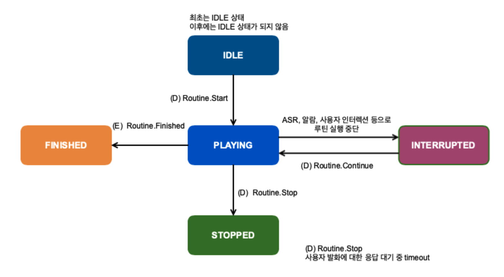

# Routine

## Version

최신 버전은 1.3 입니다.

| Version | Date       | Description                                                                                                                                     |
|:--------|:-----------|:------------------------------------------------------------------------------------------------------------------------------------------------|
| 1.0     | 2020.11.10 | 규격 추가                                                                                                                                           |
| 1.1     | 2020.11.13 | Context 의 actions 에 postDelayInMilliseconds 추가<br/>Start directive 의 actions 에 postDelayInMilliseconds 추가                                       |
| 1.2     | 2020.12.10 | Context 의 routineActivity 에 INTERRUPTED 추가                                                                                                      |
| 1.3     | 2022.10.11 | context와 Start directive에 routineId, routineType, routineListType 필드 추가<br/>muteDelayInMilliseconds, Move 디렉티브, MoveSucceeded/MoveFailed 이벤트 추가 |

## State Diagram



## SDK Interface

Routine 은 정해진 Action 을 SDK 내부에서 순차적으로 실행하며 Application 에서 처리할 별도의 interface 가 없습니다.

## Context


```json
{
  "Routine": {
    "version": "1.3",
    "token": "{{STRING}}",
    "name": "{{STRING}}",
    "routineId": "{{STRING}}",
    "routineType": "{{STRING}}",
    "routineListType": "{{STRING}}",
    "routineActivity": "{{STRING}}",
    "currentAction": {{LONG}},
    "actions": [
      {
        "type": "{{STRING}}",
        "text": "{{STRING}}",
        "data": { # object },
        "playServiceId": "{{STRING}}",
        "token": "{{STRING}}",
        "muteDelayInMilliseconds": {{LONG}},
        "postDelayInMilliseconds": {{LONG}},
        "actionTimeoutInMilliseconds": {{LONG}}
      }
    ]
  }
}
```


| parameter       | type   | mandatory | description                                                                                                                                                                                                                                                                                                  |
|:----------------|:-------|:----------|:-------------------------------------------------------------------------------------------------------------------------------------------------------------------------------------------------------------------------------------------------------------------------------------------------------------|
| token           | string | N         | Routine.Play Directive에서 전달한 루틴을 식별하기 위한 unique한 string<br/>연속된 루틴 간에 동일한 token을 전달하지 않도록 주의                                                                                                                                                                                                                 |
| name            | string | N         | 디스플레이가 있는 디바이스에서 현재 루틴의 이름을 보여주기 위해 사용됨                                                                                                                                                                                                                                                                      |
| routineId       | string | N         | 루틴이 가지는 고유한 id                                                                                                                                                                                                                                                                                               |
| routineType     | string | N         | **VOICE**<br/>**SCHEDULE<br/>**ALARM_OFF<br/>**APP_START**                                                                                                                                                                                                                                                   |
| routineListType | string | N         | **USER**<br/>**PRESET<br/>**RECOMMEND**                                                                                                                                                                                                                                                                      |
| routineActivity | string | Y         | **IDLE** : 루틴을 한번도 실행하지 않은 경우<br/>**PLAYING** : 루틴이 실행되고 있는 경우<br/>**INTERRUPTED** : 루틴이 어떤 이유로든 중단된 경우<br/>**FINISHED** : 마지막 액션까지 정상적으로 실행이 종료된 경우<br/>**STOPPED** : 끝까지 실행하지 못하고 종료된 경우<br/>**SUSPENDED** : 끝까지 실행하지 못하고 종료된 경우</p><p><strong>SUSPENDED</strong> - BREAK에 의해 action 리스트 중간에서 실행을 쉬고 있는 경우 |
| currentAction   | long   | N         | 현재 실행 중인 Action의 순서 1부터 시작하며, 마지막 Action의 값은 actions 의 개수와 같아야 함                                                                                                                                                                                                                                             |
| actions         | list   | N         | Start Directive 참조                                                                                                                                                                                                                                                                                           |

## Directives

### Start


```json
{
  "header": {
    "namespace": "Routine",
    "name": "Start",
    "messageId": "{{STRING}}",
    "dialogRequestId": "{{STRING}}",
    "version": "1.3"
  },
  "payload": {
    "playServiceId": "{{STRING}}",
    "token": "{{STRING}}",
    "name": "{{STRING}}",
    "routineId": "{{STRING}}",
    "routineType": "{{STRING}}",
    "actions": [
      {
        "type": "{{STRING}}",
        "text": "{{STRING}}",
        "data": {},
        "playServiceId": "{{STRING}}",
        "token": "{{STRING}}",
        "muteInMilliseconds": {{LONG}},
        "postDelayInMilliseconds": {{LONG}},
        "actionTimeoutInMilliseconds": {{LONG}}
      }
    ],
    "source": "{{STRING}}"
  }
}
```


| parameter                            | type   | mandatory | description                                                                                                                                                                |
|:-------------------------------------|:-------|:----------|:---------------------------------------------------------------------------------------------------------------------------------------------------------------------------|
| token                                | string | Y         | 전달하는 루틴을 식별하기 위한 unique string                                                                                                                                             |
| actions                              | list   | Y         | 루틴을 구성하는 Action을 포함하는 list                                                                                                                                                 |
| actions.type                         | string | Y         | 전송하는 Event Type<br/>**TEXT** : Text.TextInput으로 "text" 파라미터 전송<br/>**DATA** : Routine.ActionTriggered Event로 data를 전송                                                      |
| actions.text                         | string | N         | type 이 TEXT 일 때 필수 값 Action을 실행하기 위한 발화                                                                                                                                    |
| actions.data                         | object | N         | type 이 DATA 일 때 필수 값 ActionTriggered Event를 전송할때 함께 전송하는 데이터 ActionTriggered Event의 "data" 파라미터에 이 object를 그대로 복사해서 전송                                                     |
| actions.playServiceId                | string | N         | text 또는 event를 실행하는 Play Service Id<br/>TEXT는 이 값이 없으면 라우팅 로직대로 라우팅                                                                                                        |
| actions.token                        | string | N         | Text.TextInput event 의 "token" parameter 로 전달해야 함                                                                                                                          |
| actions.muteDelayInMilliseconds      | long   | N         | 응답에 TTS.Speak Directive가 없는 경우 다음 action을 실행할때까지 기다려야 하는 시간                                                                                                         |
| actions.postDelayInMilliseconds      | long   | N         | 해당 Action 의 ActionTriggered event 요청으로 전달받은 모든 directive 를 실행한 후 다음 Action 의 ActionTriggered event 를 요청하기 전까지 강제로 설정하는 delay 시간<br/>단위 : msec<br/>default : 0 (delay가 없음)  |
| actions. actionTimeoutInMilliseconds | long   | N         | 현재 action이 AudioPlayer를 사용해서 미디어를 재생하는 경우에만 사용됨                                                                                                                     |
| source                               | string | N         | TextInput Source 입력 사용 가능한 값은 Text Interface에 정의됨                                                                                                                   |

### Stop

현재 실행 중인 루틴을 종료


```json
{
  "header": {
    "namespace": "Routine",
    "name": "Stop",
    "messageId": "{{STRING}}",
    "dialogRequestId": "{{STRING}}",
    "version": "1.3"
  },
  "payload": {
    "playServiceId": "{{STRING}}",
    "token": "{{STRING}}"
  }
}
```


| parameter | type   | mandatory | description                        |
|:----------|:-------|:----------|:-----------------------------------|
| token     | string | Y         | context에서 현재 동작 중인 루틴의 token 값을 사용 |

### Continue

현재 실행 중인 루틴을 이어서 실행

실행 중인 Action은 멈추고 다음 Action부터 실행됨


```json
{
  "header": {
    "namespace": "Routine",
    "name": "Continue",
    "messageId": "{{STRING}}",
    "dialogRequestId": "{{STRING}}",
    "version": "1.3"
  },
  "payload": {
    "playServiceId": "{{STRING}}",
    "token": "{{STRING}}"
  }
}
```


| parameter | type   | mandatory | description                        |
|:----------|:-------|:----------|:-----------------------------------|
| token     | string | Y         | context에서 현재 동작 중인 루틴의 token 값을 사용 |

### Move

루틴에 포함된 임의의 액션의 위치로 이동


```json
{
  "header": {
    "namespace": "Routine",
    "name": "Move",
    "messageId": "{{STRING}}",
    "dialogRequestId": "{{STRING}}",
    "version": "1.3"
  },
  "payload": {
    "playServiceId": "{{STRING}}",
    "position": {{LONG}}
  }
}
```


| parameter     | type   | mandatory | description                              |
|---------------|--------|-----------|------------------------------------------|
| playServiceId | string | Y         | context에서 현재 동작 중인 루틴의 token 값을 사용       |
| position      | string | Y         | 이동하고자 하는 action 위치를 지정(currentAction 기준) |

## Events

### Started

루틴의 첫번째 Action을 실행하기 전에 전달


```json
{
  "header": {
    "namespace": "Routine",
    "name": "Started",
    "messageId": "{{STRING}}",
    "dialogRequestId": "{{STRING}}",
    "version": "1.3"
  },
  "payload": {
    "playServiceId": "{{STRING}}"
  }
}
```


### Failed

루틴 실행이 실패하는 경우

Routine.Play, Routine.Continue Directive의 응답으로 전송 가능


```json
{
  "header": {
    "namespace": "Routine",
    "name": "Failed",
    "messageId": "{{STRING}}",
    "dialogRequestId": "{{STRING}}",
    "version": "1.3"
  },
  "payload": {
    "playServiceId": "{{STRING}}",
    "errorMessage": "{{STRING}}"
  }
}
```


| parameter    | type   | mandatory | description |
|:-------------|:-------|:----------|:------------|
| errorMessage | string | Y         |             |

### Finished

마지막 Action까지 정상적으로 실행이 종료된 경우 발생


```json
{
  "header": {
    "namespace": "Routine",
    "name": "Finished",
    "messageId": "{{STRING}}",
    "dialogRequestId": "{{STRING}}",
    "version": "1.3"
  },
  "payload": {
    "playServiceId": "{{STRING}}"
  }
}
```


### Stopped

모든 Action이 실행되기 전에 Routine.Stop Directive 또는 시스템 이슈로 종료된 경우


```json
{
  "header": {
    "namespace": "Routine",
    "name": "Stopped",
    "messageId": "{{STRING}}",
    "dialogRequestId": "{{STRING}}",
    "version": "1.3"
  },
  "payload": {
    "playServiceId": "{{STRING}}"
  }
}
```


### ActionTriggered


```json
{
  "header": {
    "namespace": "Routine",
    "name": "ActionTriggered",
    "messageId": "{{STRING}}",
    "dialogRequestId": "{{STRING}}",
    "version": "1.0"
  },
  "payload": {
    "playServiceId": "{{STRING}}",
    "data": {}
  }
}
```


| parameter | type   | mandatory | description                |
|:----------|:-------|:----------|:---------------------------|
| data      | object | Y         | DATA type의 Action에서 보낼 데이터 |

### MoveSucceeded

루틴 수행 중에 Move 디렉티브가 전송되었고 이동도 성공하는 경우


```json
{
  "header": {
    "namespace": "Routine",
    "name": "MoveSucceeded",
    "messageId": "{{STRING}}",
    "dialogRequestId": "{{STRING}}",
    "version": "1.0"
  },
  "payload": {
    "playServiceId": "{{STRING}}"
  }
}
```


### MoveFailed

실행 중인 루틴이 없는데 Move 디렉티브가 전송되는 경우, 루틴이 실행 중인데 이동에 실패하는 경우


```json
{
  "header": {
    "namespace": "Routine",
    "name": "MoveFailed",
    "messageId": "{{STRING}}",
    "dialogRequestId": "{{STRING}}",
    "version": "1.0"
  },
  "payload": {
    "playServiceId": "{{STRING}}",
    "errorMessage": "{{STRING}}"
  }
}
```


### MoveControl

루틴의 순서를 제어하는 동작이 앱에서 발생하는 경우 루틴 Play로 전송하는 이벤트


```
{
  "header": {
    "namespace": "Routine",
    "name": "MoveControl",
    "messageId": "{{STRING}}",
    "dialogRequestId": "{{STRING}}",
    "version": "1.0"
  },
  "payload": {
    "playServiceId": "{{STRING}}",
    "offset": {{LONG}}
  }
}
```


| parameter | type | mandatory | description         |
|-----------|------|-----------|---------------------|
| offset    | long | Y         | -1 : 이전<br/>+1 : 다음 |