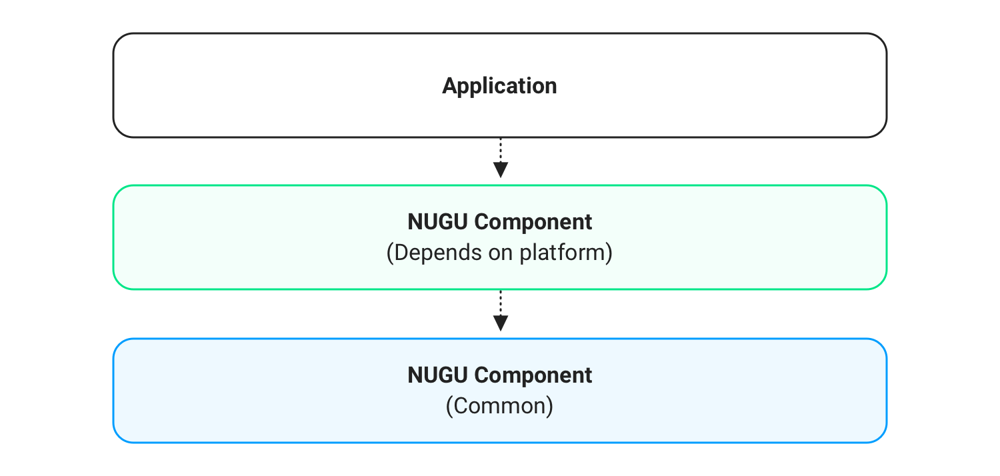

# Platform

## NUGU SDK Architecture

NUGU SDK를 더 자세히 알아보기 위해서는 각각의 플랫폼 별 페이지를 통해 확인하실 수 있습니다.

## System Requirements

| Requirement   | Android                                                                   | iOS                                                                       | Linux                                                                  |
|:--------------|:--------------------------------------------------------------------------|:--------------------------------------------------------------------------|:-----------------------------------------------------------------------|
| OS Version    | \\\>= Android 5.0(API level 21)                                           | \\\>= iOS 10.0+                                                           | \\\>= Ubuntu Linux 16.04                                               |
| Platform      | Android                                                                   | iOS                                                                       | Ubuntu Linux Raspberry Pi Generic Linux                                |
| Language      | Kotlin                                                                    | Swift                                                                     | C, C++                                                                 |
| Architecture  | arm7, arm64                                                               | arm7, arm64                                                               | x86_64, arm64, armhf                                                   |
| Repository    | Github                                                                    | Github                                                                    | Github                                                                 |
| Release       | Maven                                                                     | Cocoapods Carthage                                                        | APT repository                                                         |
| Storage       | Touch로만 wake up: 13MB Wake up word 1개: 14MB Wake up word 2개: 15MB | Touch로만 wake up: 14MB Wake up word 1개: 15MB Wake up word 2개: 16MB | Touch로만 wake up: 6MB Wake up word 1개: 7MB Wake up word 2개: 8MB |







