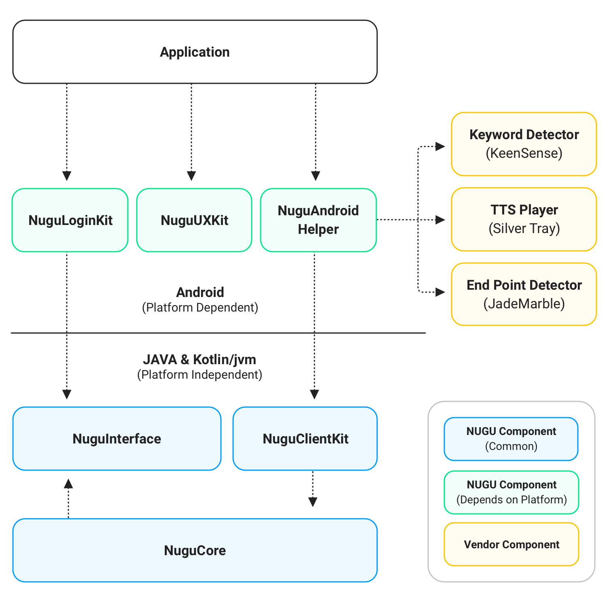

# 구성요소



## 구성요소 목록


NUGU SDK for Android 를 통한 개발을 위해서는 `NuguCore`, `NuguInterface`를 필수로 포함해야합니다.


* NUGU Component(Common)
  * `NuguCore` : NUGU 서비스 이용에 필요한 구성요소들의 기본 구현을 제공합니다.
  * `NuguInterface` : NUGU SDK를 구성하는 필수 요소에 대한 인터페이스와 데이터 타입 등을 제공합니다.
  * `NuguAgent` : NUGU SDK를 구성할 때 필요한 capability agent를 제공합니다.
  * `NuguClientKit` : NUGU서비스를 쉽게 개발할 수 있도록 도와주는 기능을 제공합니다.
* NUGU Component(Depends on platform)
  * `NuguAndroidHelper` : NUGU서비스를 안드로이드 플랫폼에서 쉽게 개발할 수 있도록 도와주는 기능을 제공합니다.
  * `NuguUXKit` :  NUGU의 디자인 가이드를 준수하는 UX 요소를 제공하고, Template 화면 노출 및 제어를 위한 도구를 제공합니다.
  * `NuguLoginKit` : NUGU의 로그인을 도와주는 기능을 제공합니다.
  * `NuguServiceKit` : NUGU 서비스의 Play 설정을 위한 WebView 를 제공합니다.
* Vendor Component
  * `KeenSense` : 키워드 인식 기능을 제공하는 라이브러리 입니다.
  * `JadeMarble` : 발화의 시작/끝 인식 기능을 제공하는 라이브러리 입니다.
  * `SilverTray` : TTS발화에 대한 NUGU서비스 전용 플레이어입니다.

## Github

### NUGU

| 이름             | 주소                                                                                                 |
|:---------------|:---------------------------------------------------------------------------------------------------|
| `nugu-android` | [https://github.com/nugu-developers/nugu-android](https://github.com/nugu-developers/nugu-android) |

## Download

NUGU SDK for Android의 구성요소는 모두 별도로 추가할 수 있습니다.


```groovy
dependencies {
    implementation "com.skt.nugu.sdk:nugu-core:${nugu_latestVersion}"
    implementation "com.skt.nugu.sdk:nugu-interface:${nugu_latestVersion}"
    implementation "com.skt.nugu.sdk:nugu-agent:${nugu_latestVersion}"
    implementation "com.skt.nugu.sdk:nugu-client-kit:${nugu_latestVersion}"
    implementation "com.skt.nugu.sdk:nugu-android-helper:${nugu_latestVersion}"
    implementation "com.skt.nugu.sdk:nugu-ux-kit:${nugu_latestVersion}"
    implementation "com.skt.nugu.sdk:nugu-login-kit:${nugu_latestVersion}"
    implementation "com.skt.nugu.sdk:nugu-service-kit:${nugu_latestVersion}"

    implementation "com.skt.nugu:keensense:${keensense_latestVersion}"
    implementation "com.skt.nugu:jademarble:${jademarble_latestVersion}"
    implementation "com.skt.nugu:silvertray:${silvertray_latestVersion}"
}
```


