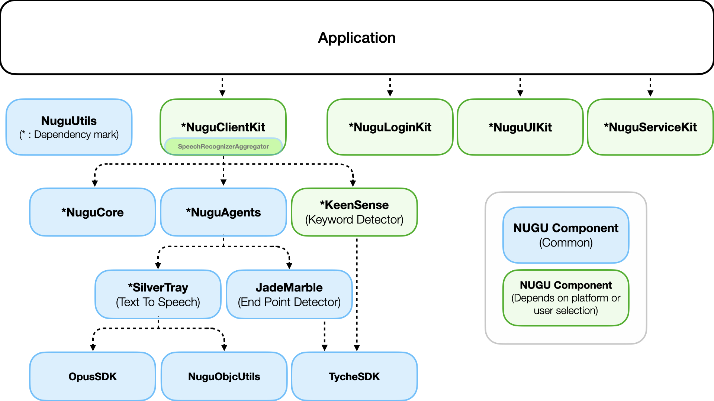

# 구성요소



## 구성요소 목록


NUGU SDK for iOS 를 통한 개발을 위해서는 `NuguCore`, `NuguAgents` Framework를 필수로 포함해야 합니다.


* NUGU Component (Common)
  * `NuguCore`: NUGU 서비스 이용에 필요한 구성요소들의 기본 구현을 제공합니다.
  * `NuguAgents`: NUGU SDK를 구성할 때 필요한 capability agent를 제공합니다.
  * `NuguUtils` : NUGU SDK 내의 공통 기능들을 묶어 사용하고 있습니다.
  * `JadeMarble`: 발화의 시작과 끝을 감지하는 기능을 제공합니다.
  * `SilverTray`: Encoding 된 `Data` stream 을 재생하기 위한 Player 를 제공합니다.
* NUGU Component (Depends on platform or user choice)
  * `NuguClientKit`: NUGU 서비스를 쉽게 개발할 수 있도록 도와주는 기능을 제공합니다. (`SpeechRecognizerAggregator` 포함)
  * `NuguLoginKit`: NUGU 서비스 이용을 위한 OAuth 인증을 도와주는 기능을 제공합니다.
  * `NuguServiceKit`: NUGU 서비스의 Play 설정을 위한 WebView 를 제공합니다.
  * `NuguUIKit`: NUGU 서비스 사용에 필요한 UI Components (VoiceChrome, Button, DisplayWebView 등) 를 제공합니다.
  * `KeenSense`: NUGU의 키워드를 감지하는 기능을 제공합니다.
* Vendor Component
  * `NattyLog`: 디버깅을 위한 로그를 출력을 도와주는 기능을 제공합니다. (iOS Application 또는 Framework에서 직접 참조 및 사용이 가능합니다.)
* External Framework
  * `RxSwift`: NUGU SDK는 내부적으로 비동기처리 등을 위해 사용하고 있습니다. (NUGU SDK for iOS의 모든 인터페이스는 RxSwift와 관계없이 제공됩니다.)
  * `Lottie-iOS` : `NuguUIKit` 내부의 애니메이션을 위해 사용하고 있습니다.

## Github

### NUGU & Vendor Components

| 이름                                                                                                                                                                                                                              | 주소                                                                                                    |
|---------------------------------------------------------------------------------------------------------------------------------------------------------------------------------------------------------------------------------|-------------------------------------------------------------------------------------------------------|
| `NuguCore`<br/>`NuguAgents`<br/>`NuguUtils`<br/>`NuguClientKit`<br/>`NuguLoginKit`<br/>`NuguServiceKit`<br/>`NuguUIKit`<br/>`KeenSense`<br/>`JadeMarble`<br/>`SilverTray`<br/>`OpusSDK`<br/>`TycheSDK`<br/>`NuguObjcUtils`      | [https://github.com/nugu-developers/nugu-ios](https://github.com/nugu-developers/nugu-ios)            |
| `NattyLog`                                                                                                                                                                                                                      | [https://github.com/nugu-developers/natty-log-ios](https://github.com/nugu-developers/natty-log-ios)  |

### External

| 이름            | 주소                                                                            |
|---------------|-------------------------------------------------------------------------------|
| `RxSwift`     | [https://github.com/ReactiveX/RxSwift](https://github.com/ReactiveX/RxSwift)  |
| `Lottie-iOS`  | [https://github.com/airbnb/lottie-ios](https://github.com/airbnb/lottie-ios)  |

## CocoaPods


NUGU iOS SDK는 의존성 관리를 위해 CocoaPods를 지원합니다.
더 자세한 내용은 [https://cocoapods.org](https://cocoapods.org)에서 확인이 가능합니다.


NUGU SDK for iOS의 각각의 구성요소는 CocoaPods를 통해 의존성 관리를 추가할 수 있습니다. 구성요소를 재구성할 때, 필요에 맞게 의존성 관리를 추가하면 됩니다.


```ruby
target 'your_application' do
    pod 'NuguCore'
    pod 'NuguAgents'
    pod 'NuguClientKit'
    pod 'NuguLoginKit'
    pod 'NuguUIKit'
    pod 'NuguServiceKit'
    pod 'KeenSense'
    pod 'JadeMarble'
    pod 'NattyLog'
    pod 'SilverTray'
end
```

