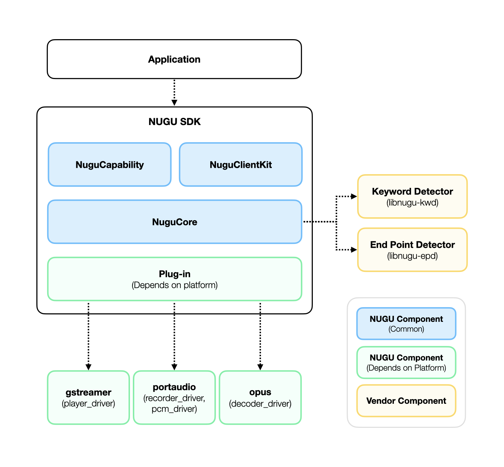

# 구성요소

## 구성요소 목록

* NUGU Component (Common)
  * `NuguClientKit`: NUGU 서비스를 쉽게 개발할 수 있도록 도와주는 기능을 제공합니다.
  * `NuguCapability`: Capability를 쉽게 제어할 수 있는 API를 제공합니다.
  * `NuguCore`: NUGU 서비스 개발에 필요한 구성요소들을 제공합니다.
* NUGU Component (Depends on platform)
  * Plug-in: 디바이스 특성에 맞게 미디어 드라이버를 구현할 수 있는 API를 제공합니다.
  * `gstreamer`: plug-in에서 제공하는 `player_driver`를 이용해서 `gstreamer`를 통한 미디어 재생 기능을 제공합니다.
  * `portaudio`: plug-in에서 제공하는 `recorder_driver`, `pcm_driver`를 이용해서 `portaudio`를 통한 음성 데이터 입/출력 기능을 제공합니다.
  * `opus`: plug-in에서 제공하는 `decoder_deriver`를 이용해서 opus 코덱을 디코딩 합니다.
* Vendor Component
  * `libnugu-kwd`: NUGU의 키워드를 감지하는 기능을 제공합니다.
  * `libnugu-epd`: 발화의 시작과 끝을 감지하는 기능을 제공합니다.

## Github

### NUGU

| 이름           | 주소                                                                                             |
|:-------------|:-----------------------------------------------------------------------------------------------|
| `nugu-linux` | [https://github.com/nugu-developers/nugu-linux](https://github.com/nugu-developers/nugu-linux) |

## 의존성 목록

NUGU SDK for Linux는 아래의 외부 라이브러리를 사용하고 있고, SDK 설치시 의존성으로 인해 자동으로 시스템에 설치됩니다.

| 이름                      | 라이센스                                                                                                                                                              |
|:------------------------|:------------------------------------------------------------------------------------------------------------------------------------------------------------------|
| PortAudio               | [MIT](http://www.portaudio.com/license.html)                                                                                                                      |
| Alsa                    | [LGPL](https://git.alsa-project.org/?p=alsa-lib.git;a=blob;f=COPYING;h=ae23fcfda2da8599b52baff4c257847205d78c56;hb=HEAD)                                          |
| Opus                    | [BSD](https://git.xiph.org/?p=opus.git;a=blob;f=LICENSE_PLEASE_READ.txt;h=bc88efa6cb05789a6a6e697577ae6d8e5532e5df;hb=HEAD)                                       |
| GStreamer               | [LGPL](https://gstreamer.freedesktop.org/documentation/application-development/appendix/licensing.html?gi-language=c)                                             |
| GLib                    | [LGPL](https://developer.gnome.org/glib/stable/glib.html)                                                                                                         |
| SSL                     | [Apache v2 (&gt;=3.0.0)](https://www.openssl.org/source/license.html), [dual OpenSSL and SSLeay license(&lt;3.0.0\)](https://www.openssl.org/source/license.html) |
| zlib                    | [zlib](https://www.zlib.net/zlib_license.html)                                                                                                                    |
| NUGU Keyword detector   | Apache v2                                                                                                                                                         |
| NUGU End point detector | Apache v2                                                                                                                                                         |

그리고 아래의 외부 Open source 들을 NUGU SDK for Linux에 포함하여 빌드하고 있습니다.

| 이름      | 주소                                                                                                       | 라이센스                                                                                                                        |
|:--------|:---------------------------------------------------------------------------------------------------------|:----------------------------------------------------------------------------------------------------------------------------|
| libcurl | [https://github.com/curl/curl.git](https://github.com/curl/curl.git)                                     | [MIT style license](https://curl.haxx.se/docs/copyright.html)                                                               |
| nghttp2 | [https://github.com/nghttp2/nghttp2.git](https://github.com/nghttp2/nghttp2.git)                         | [MIT](https://github.com/nghttp2/nghttp2/blob/master/COPYING)                                                               |
| jsoncpp | [https://github.com/open-source-parsers/jsoncpp.git](https://github.com/open-source-parsers/jsoncpp.git) | [MIT](https://github.com/open-source-parsers/jsoncpp/blob/master/LICENSE)                                                   |
| Opus    | [https://opus-codec.org/development](https://opus-codec.org/development)                                 | [BSD](https://git.xiph.org/?p=opus.git;a=blob;f=LICENSE_PLEASE_READ.txt;h=bc88efa6cb05789a6a6e697577ae6d8e5532e5df;hb=HEAD) |

