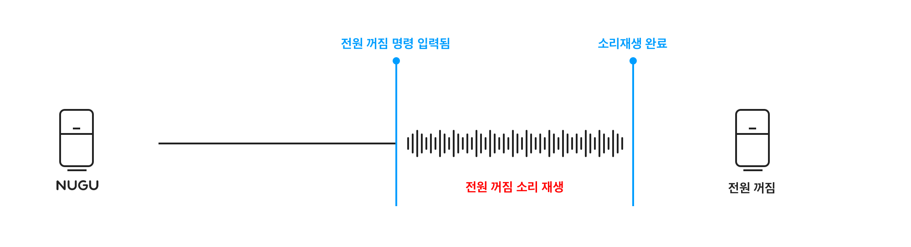

# NUGU 기기

NUGU를 탑재한 기기의 상태에 따른 동작, 제공하는 물리적 버튼, 조명, 소리에 대한 가이드는 다음과 같습니다.

## 기기 상태

NUGU를 탑재한 기기의 상태는 다음과 같습니다.

| 기기 상태          | 설명                                                                                                                                                                  |
|----------------|---------------------------------------------------------------------------------------------------------------------------------------------------------------------|
| **음소거**        | 기기의 소리가 출력되지 않는 상태입니다. 음소거 상태일 때는 Prompt나 사운드, 비프음을 볼륨 레벨 0으로 출력합니다. 단, alert형 안내(알람 울림, 타이머 울림, Notification 울림, 전화벨 울림)가 실행될 때는 음소거 상태일지라로 원래 음량으로 실행됩니다. |
| **마이크 켜짐/꺼짐**  | NUGU 기의 음성인식 마이크가 꺼져 있는 상태로, 이 상태에서는 음성으로 에이전트를 wake up할 수 없습니다.                                                                                                    |
| **야간 모드**      | 디스플레이가 있는 기에서 전원 절약을 위하 화면 표시가 최소화된 상태입니다.                                                                                                                          |
| **화면 켜짐/꺼짐**   | 디스플레이가 있는 기에서 화면이 켜져있거나 꺼져있는 상태입니다.                                                                                                                                 |
| **무드등 켜짐/꺼짐**  | 조명 기능이 있는 기에서 조명이 켜져있거나 꺼져있는 상태입니다.                                                                                                                                 |
| **네트워크 미연결**   | 기기가 네트워크에 연결되지 않은 상태를 말합니다. 이 상태에서는 wake up시 곧바로 네트워크가 연결되어 있지 않음을 알려주는 Prompt를 제공합니다.                                                                          |

#### **초기 기기 상태**

NUGU 기기의 초기 상태는 다음과 같습니다. 마이크(Microphone) on / 와이파이 on / 블루투스 off / 볼륨 unmute / 무드등 off

## 버튼

NUGU 기기에서 제공하는 물리적 버튼들은 다음과 같습니다. 기기에 따라 제공되지 않거나 추가적인 버튼이 제공될 수 있습니다.

| 버튼 유형         | 기능                                                                                                                                                            |
|---------------|---------------------------------------------------------------------------------------------------------------------------------------------------------------|
| **호출 버튼**     | • 호출어를 말하는 것과 동일하게, listening-passive 상태가 되도록 합니다. • 마이크가 꺼져 있는 상태에서 wake-up 버튼을 누를 경우, 마이크가 켜지고 listening - passive 상태로 변경됩니다. 한번 마이크가 켜지면 해당 상태는 유지됩니다. |
| **마이크 버튼**    | • 기기의 마이크를 끄거나 켭니다. • 마이크가 꺼진 상태 (microphone off) 상태에서 호출어를 발화하여도 기기가 wake up되지 않습니다.                                                                     |
| **볼륨 조절 버튼**  | • 볼륨 조절 버튼은 증가 버튼과 감소 버튼이 각각 제공되며, 한 번 누를 때마다 음량을 증감합니다. • 길게 누르면 연속적으로 음량을 증가 또는 감소시킵니다. • 이 버튼이 동작될 때는 증감된 음량이 어느 정도인지를 사용자가 알 수 있도록 소리 피드백이 제공됩니다. |
| **음소거 버튼**    | • 기기를 음소거 상태로 설정하거나 해제합니다.                                                                                                                                    |
| **블루투스 버튼**   | • 블루투스로 다른 기기와 페어링을 하거나 해제합니다.                                                                                                                                |

* 자주 사용하는 버튼은 기기의 상단 부에 배치하여 누르기 용이하도록 합니다.
* 서로 대응되는 버튼(예: 볼륨 증가, 볼륨 감소 버튼)은 가까운 곳에 배치하여 사용자가 위치를 쉽게 인지할 수 있도록 합니다.
* 버튼을 눌렀을 때 버튼이 눌렸다는 것을 사용자가 소리 또는 LED를 통해 알 수 있도록 합니다.
* 버튼을 길게 누르거나, 2개 이상의 버튼 조합으로 기능이 실행되도록 할 수 있습니다. 이렇게 동작하는 방식은 사용자가 인지하고 사용하기 어려우므로 자주 사용하지 않는 기능이나, 쉽게 실행되어서는 안 되는 기능을 제공할 때 사용하도록 합니다.

## 조명

조명을 이용하여 현재의 상태 및 사용자 요청에 대한 결과를 피드백할 수 있습니다.

다음은 NUGU 기기 모델 별로 사용되고 있는 조명 색상 및 그 의미입니다.

| 동작 상태         | NU100          | NU110                    | NU200         | 의미                                |
|---------------|----------------|--------------------------|---------------|-----------------------------------|
| 전원 켜짐/꺼짐      | Emerald Green  | Default White            | White         | 기기의 전원이 켜질 때, 혹은 꺼질 때 조명          |
| Listening 상태  | Emerald Green  | Sky blue                 | Sky Blue      | 사용자가 말하는 것을 듣고 있음                 |
| Speaking 상태   | Blue           | Ocean blue와 Sky blue 교차  | Blue          | NUGU가 말하고 있음                      |
| Wi-Fi 연결 중    | Yellow Green   | Lime과 Green교차            | Yellow Green  | 무선 네트워크에 연결 중                     |
| Wi-Fi 연결 성공   | Blue           | Lime                     | Yellow Green  | Wi-Fi 연결에 성공                      |
| Wi-Fi 연결 실패   | Pink           | Red와 Orange 교차           | Pink          | Wi-Fi 연결에 실패함                     |
| 주의 / 실패       | Pink           | Red와 Orange 교차           | Pink          | 사용자 요청을 수행하는 데에 실패하였거나, 재시도가 필요함  |
| 시스템 에러        | Red            | Red와 Orange 교차           | Red           | 에러가 있거나, 사용 불가함                   |
| 펌웨어 업데이트      | Purple         | Purple                   | Purple        | NUGU가 업데이트 중임                     |

## 소리

효과음은 음성이 아닌 비프음이나 사운드 등을 의미합니다. 상황 별 정해진 특징적인 효과음을를 제공함으로써 음성으로 설명하지 않고도 상태 및 동작에 대하여 사용자가 인식할 수 있도록 합니다. 효과음은 대 상태를 알리는 데에 사용되는 1) 기본 효과음과 특정 서비스 동작과 관련된 2)서비스 효과음로 나뉩니다.

### **1) 기본 효과음(Basic Feedback Sound)**

**전원 켜짐 완료 (Boot complete)**

전원이 켜져 사용 가능 상태가 되었을 때 사운드를 제공합니다.

| 재생 조건                      | On/Off 설정                                            |
|----------------------------|------------------------------------------------------|
| 부팅 완료 후 Welcome Prompt 직전  | • On/Off 설정 없으며 항상 소리를 제공 • 기기별로 설정 가능           |

**호출 효과 (Wake up success)**

호출어를 발화하여 대화 상가 listening 상태가 되는 순간에 비프음을 제공합니다. 사용자의 발화를 인식할 준비가 되었다는 의미로써, 호출어를 발화하지 않고 호출 버튼을 누른 경우나 필수 entity를 입력받기 위해 speaking 상태 이후 바로 listening 상태가 될 때(Slot-filling)에도 해당 비프음이 발생됩니다.

| 재생 조건         | On/Off 설정                                                            |
|---------------|----------------------------------------------------------------------|
| Wake up 성공 시  | • 애플리케이션에서 On/Off 설정을 제공 • 기본 값은 ON • 기기별로 설정 가능             |

호출어 발화 시

Slot-filling 시

**인식 완료음 (End listen)**

Listening 상태에서 사용자의 발화가 완료되어 Listening 상태가 종료 되었을때 비프음을 제공합니다. NUGU App에서 텍스트 명령 전송 시에는 제공하지 않습니다.

| 재생 조건                 | On/Off 설정                                           |
|-----------------------|-----------------------------------------------------|
| Wake up 후 발화 인식 성공 시  | • 애플리케이션에서 On/Off 설정을 제공 • 기기별로 설정 가능           |

#### **응답 실패 (Response fail)**

사용자의 발화가 제대로 인식되지 않아 정상 동작을 할 수 없는 경우, 응답 실패 비프음을 재생합니다.

| 재생 조건                                                                                                                                                                                                                                                       | On/Off 설정                                             |
|-------------------------------------------------------------------------------------------------------------------------------------------------------------------------------------------------------------------------------------------------------------|-------------------------------------------------------|
| • 잡음 인식 시 • 1음절 발화 인식 시 (일부 1음절 발화는 화이트 리스트로 관리, 인식 가능) • 블랙 리스트로 관리되는 발화를 실행하여 OOD 처리되는 경우 • 호출 버튼을 눌러 진입된 listening 상태에서 사용자 발화가 없어 타임아웃 된 경우 • Slot-filling을 위한 listening 상태에서 사용자 발화가 없어 타임아웃 된 경우 • 호출 버튼을 눌러 listening 상태가 해제된 경우 | • App에서 On/Off 설정을 제공 • 기본 값은 ON • 기기별로 설정 가능 |

잡음 / 1음절 발화 / 블랙 리스트 발화 시

Slot-filling을 위한 listening 상태에서 타임아웃 시

**전원 꺼짐 (Power off)**

전원 버튼을 눌러 전원을 끌 경우, 사운드를 제공하여 전원이 꺼질 것임을 알립니다.

| 재생 조건     | On/Off 설정                                  |
|-----------|--------------------------------------------|
| 전원을 끌 경우  | • On/Off 설정 없으며 항상 소리를 제공 • 기기별로 설정 가능 |

### **2) 서비스 효과음(Service Feedback Sound)**

서비스 효과음는 특정 서비스 내에서 동작을 사용자가 인지하기 쉽도록 하거나, 감성을 전달하고자 할 때 사용합니다. 서비스 소리가 재생될 때는 응답 효과(End listen)은 재생하지 않습니다. 다음은 NUGU 기기에 적용된 서비스 효과의 예시입니다.

#### **무드등 제어 (Mood light on/off)**

사용자 발화에 의해 무드등을 켜거나 끌 때 제공되는 효과입니다. 하드웨어 버튼으로 무드등을 켜고 끌 때에는 소리를 제공하지 않습니다.

| 재생 조건                | 사용자 발화에 의한 동작  | 하드웨어 버튼 조작에 의한 동작  |
|----------------------|----------------|--------------------|
| 무드등이 켜질 때 (색 변경 포함)  | 무드등 제어음 재생 O   | 무드등 제어음 재생 X       |
| 무드등이 꺼질 때            | 무드등 제어음 재생 O   | 무드등 제어음 재생 X       |

**볼륨 제어 (Volume up/down)**

볼륨을 올리거나 내릴 때 제공되는 효과입니다. 볼륨 제어 이후에 소리를 재생하여, 사용자가 변경된 볼륨 크기를 인지할 수 있도록 합니다. 음원이나 Prompt 재생 중에는 재생되고 있는 음원/Prompt로 볼륨 크기를 인지할 수 있으므로 볼륨 제어 효과음을 제공하지 않습니다. 볼륨을 0으로 변경 시에는 볼륨 제어 소리를 재생하여도 음소거 상태이므로 볼륨 제어 소리가 들리지 않게 되며 이는 정상 동작입니다. 하드웨어 버튼으로 볼륨 조절 시에도 소리를 제공하도록 합니다.

| 사용자 발화    | 사용자 발화에 의한 동작  | 하드웨어 버튼 조작에 의한 동작         |
|-----------|----------------|---------------------------|
| 볼륨을 높일    | 볼륨 제어음 재생 O    | 볼륨 제어음 재생 O               |
| 볼륨을 낮출 때  | 볼륨 제어음 재생 O    | 볼륨 제어음 재생 O               |

