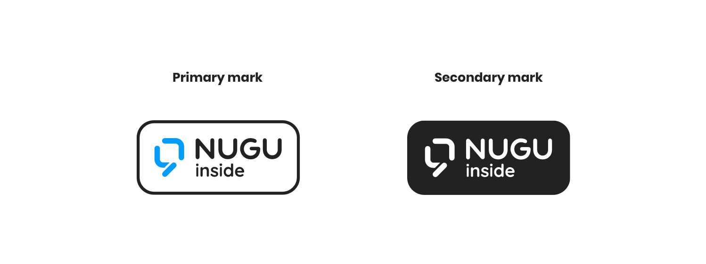
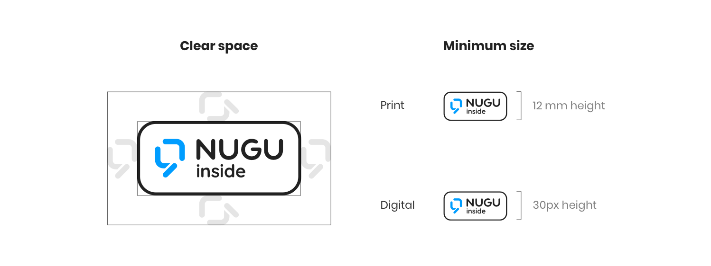
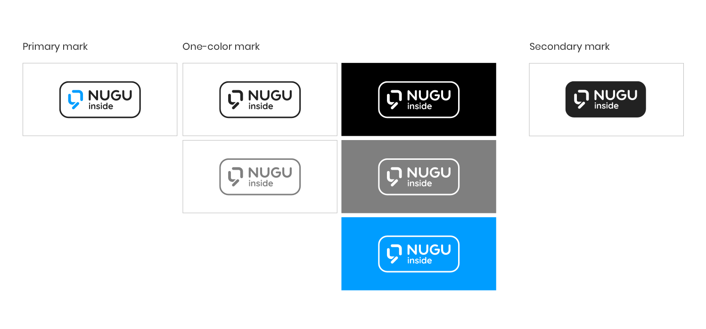
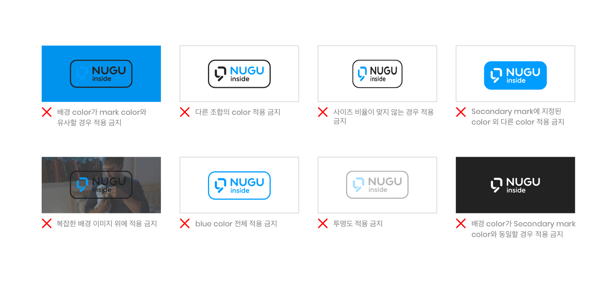
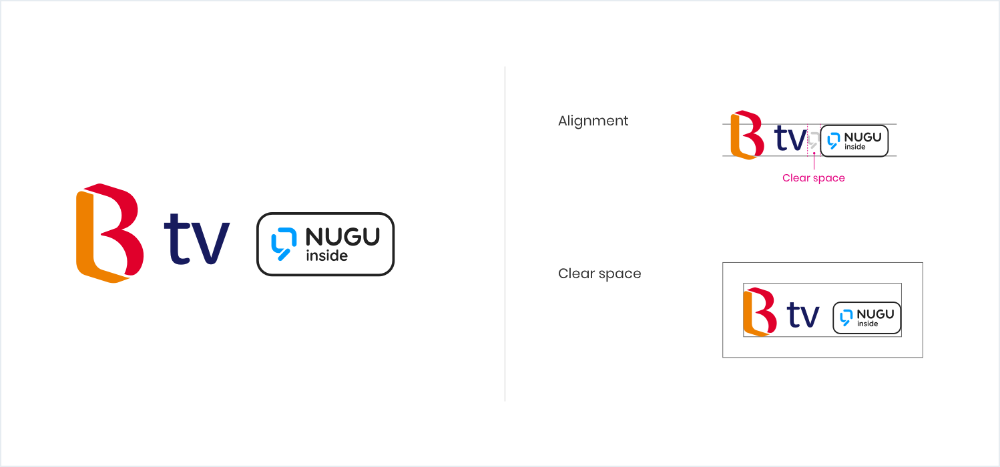
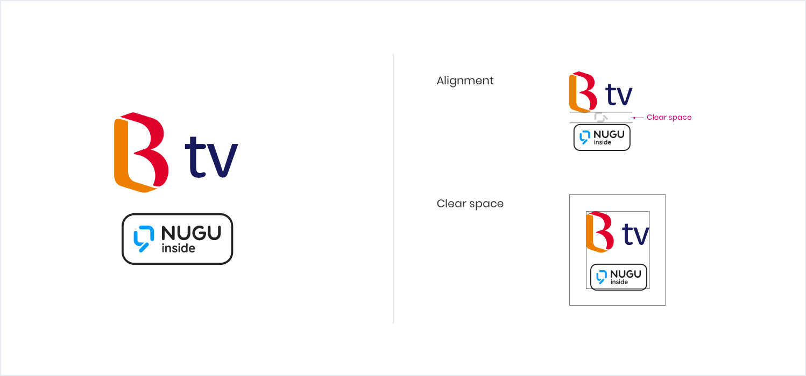
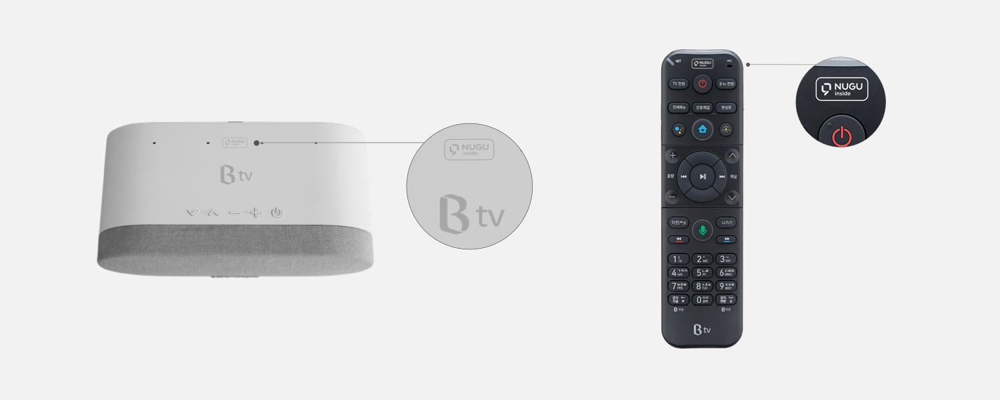
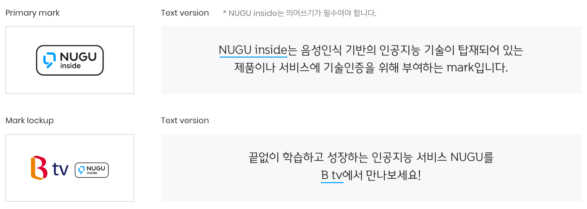

# NUGU Inside

## **NUGU inside 마크**

NUGU inside 마크는 NUGU의 기술이 탑재되었음을 직접적으로 알려주는 중요한 브랜드 요소입니다.\
적용 매체와 환경의 특성을 파악하여 인쇄 매체와 같은 표현물에 NUGU inside 마크가 제대로 표시되도록 해야 합니다.

최소 공간 규정은 마크의 NUGU 심볼의 너비만큼의 여백을 두고 적용합니다.\
마크 최소 크기는 인쇄물일 때 1.2 밀리미터, 화면에 표시할 경우 30 픽셀의 높이를 준수합니다.

## **NUGU inside 색상**

| Color                                                  | RGB                      | CMYK            | Pantone  |
|--------------------------------------------------------|--------------------------|-----------------|----------|
|  NUGU Blue | 0,158, 255 (#009DFF)     | 85, 21, 0, 0    | 2925C    |
|  Black      | 34, 34, 34 (#222222)     | 75, 68, 67, 90  |          |
|  White      | 255, 255, 255 (#FFFFFF)  | 0, 0, 0, 0      |          |

## **NUGU inside 배경색상**

NUGU inside 마크 배경 색상의 명암에 따라 positive와 negative로 사용할 수 있습니다. 어두운 배경과 NUGU blue 색상이 배경으로 사용되는 경우는 negative로만 사용합니다.\
NUGU inside 배경은 기기나 제품, 재질 등에 따라 맞게 적용해야 하며 아래 조합 중 하나를 사용해야 합니다.

## **NUGU inside 적용규칙**

### 브랜드 로고 조합형

서비스 브랜드 로고와 NUGU inside 마크가 조합된 형태는 브랜드 로고 우측이나 하단에 마크가 위치하며, 예시와 같은 간격을 두고 사용합니다.

### 기기 적용

기기에 적용 시 마크의 최소 크기와 정해진 색상과 배경을 준수해야 합니다.

## NUGU inside 텍스트 표기

본문 텍스트 또 그에 준하는 문장 속에 NUGU inside라는 명칭이 나오는 경우 마크를 사용하지 않습니다.\
제품/서비스 브랜드 조합형은 해당 브랜드명만 표기합니다.

