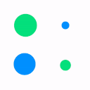
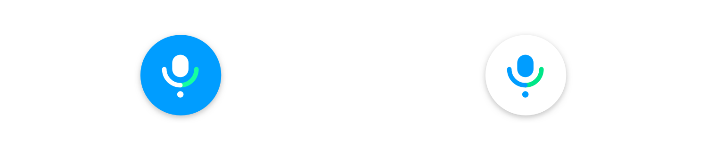
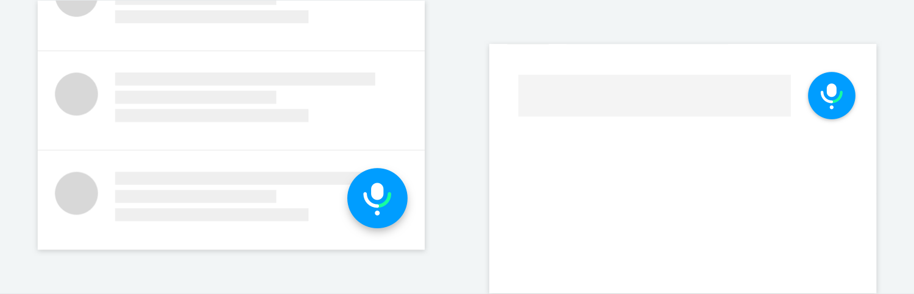
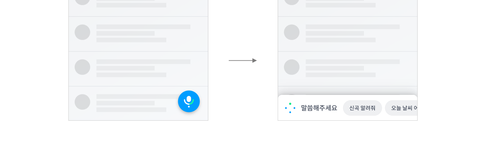
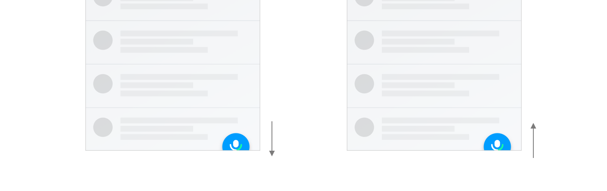
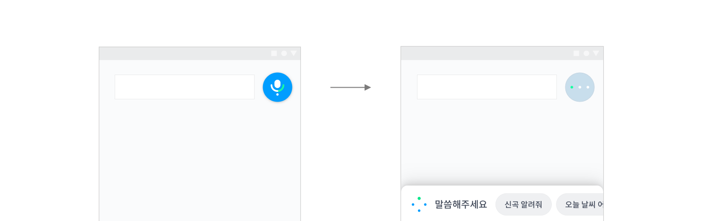
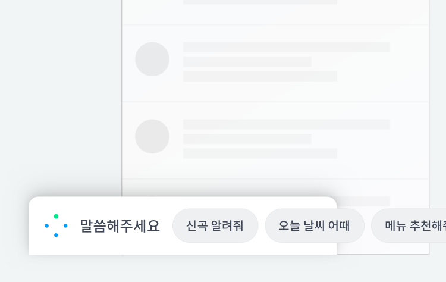
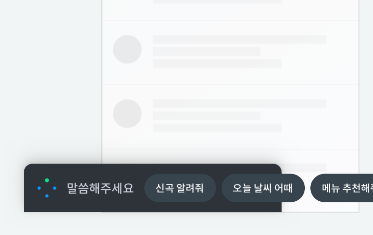
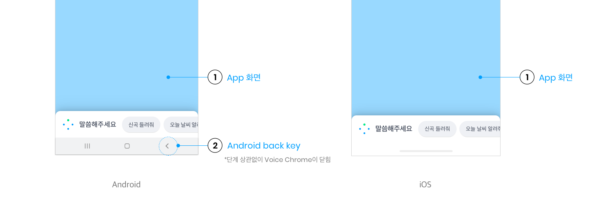

# Voice Chrome

화면이 있는 기기는 NUGU Voice Chrome을 표현해야 합니다.\
NUGU Voice Chrome은 사용자의 음성 입력 수신, NUGU 음성 출력 등 NUGU 음성 동작과 관련된 상태를 버튼과 그래픽, 색상, 모션으로 표현합니다.\
Voice Chrome 외에 디스플레이 기능을 추가하기 위해 LED를 사용할 수도 있습니다.

## **NUGU Voice Chrome 색상**

| Color                                                  | RGB                   | CMYK         | Pantone |
|--------------------------------------------------------|-----------------------|--------------|---------|
|  NUGU Blue | 0,158, 255 (#009DFF)  | 85, 21, 0, 0 | 2925C   |
|  Green     | 0, 230, 136 (#00E688) | 48, 0, 45, 0 | 2412C   |

## **NUGU Voice Chrome 상태**

NUGU Voice Chrome은 구분된 상태에 따라 표현이 달라집니다.

Idle 상태는 '**NUGU Voice Button**'을 사용하고, 나머지 상태는 그래픽 애니메이션으로 표현합니다.

상태 그래픽은 '**Chrome Indicator**'라고 말합니다.

기기에 Wake-up 버튼이 탑재해 있을 경우 NUGU Voice Button은 미노출도 허용합니다.

| 상태                    |                      동작                      | 설명                     |
|-----------------------|:--------------------------------------------:|------------------------|
| **Idle**              |  | Wake-up 가능한 대기 상태      |
| **Listening-Passive** |  | 사용자 발화 입력 대기 상태        |
| **Listening-Active**  |  | 사용자 발화 입력 중 상태         |
| **Processing**        |  | 입력된 사용자 발화를 분석하는 상태    |
| **Speaking**          |  | 정보/동작에 대해서 TTS 답변하는 상태 |

\[동작설명]

* 사용자가 호출어를 부르거나, NUGU Voice Button을 눌러 클라이언트가 **사용자 발화 입력 대기 모드**로 진입하면 **Listening-Passive** 동작을 재생합니다.
* **Listening-Passive** 동작은 사용자의 실제 음성 입력이 시작되기 전까지 반복 재생합니다.
* 사용자의 실제 음성이 입력되기 시작하여 클라이언트가 **사용자 발화 입력 중** 상태로 진입하면 사용자의 음성 입력이 끝날 때까지 **Listening-Active** 동작을 반복 재생합니다.
* 사용자의 입력이 끝나고 클라이언트가 **입력된 사용자 발화를 분석하는 상태**로 진입하면 응답을 출력하거나 결과 화면을 보여주기 전까지 **Processing** 동작을 반복 재생합니다.
* **Speaking** 동작은 연속 대화의 NUGU Voice Chrome Window가 유지된 상태에서 응답이 시작될 때부터 종료될 때까지 반복 재생합니다. 일반적인 TTS 응답 시에는 제공하지 않아도 됩니다.
* 사용자 요청에 대한 작업 수행을 완료하면 클라이언트는 **Idle** 상태로 진입하게 됩니다.

## **NUGU Voice Button**

NUGU Voice Button은 음성 입력이 가능한 대기 상태를 나타내는 버튼입니다.

BLUE / WHITE 컬러타입 중 한 가지를 선택 적용할 수 있습니다.

Idle 상태에 적용되며, **FAB** (Floating Action Button) 또는 **Button** 타입으로 사용하는 것을 권장합니다. (FAB과 Button은 Elevation값에 차이가 있습니다.)

FAB과 Button에 따른 사용 및 동작 정의는 다음과 같습니다.

* NUGU Voice Button과 아래 레이어의 콘텐츠가 중첩되는 경우 **FAB 사용** (화면 우하단 권장)
* NUGU Voice Button이 콘텐츠 중첩 없이 독립된 영역을 확보하고 있는 경우 **Button 사용** (검색창 옆 권장)



(1) **FAB**을 눌러 보이스크롬을 호출하면 FAB 버튼은 사라집니다.

(1-1) **FAB**은 스크롤 방향에 따라 노출 여부를 달리할 수 있습니다.




(2) **Button**을 눌러 Voice Chrome을 호출하면, Toggle Button 버튼으로 상태가 변경됩니다.




## **NUGU Voice Chrome Window**

Voice Chrome 을 실행하면 NUGU Voice Chrome Window가 활성화됩니다. Voice Chrome은 최상단 레이어이며, 화면의 하단 영역에 위치합니다. Light / Dark Theme 중 한 가지 타입을 선택해 적용할 수 있습니다.

| Light Theme                                  | Dark Theme                                   |
|----------------------------------------------|----------------------------------------------|
|  |  |

Voice Chrome Window를 닫는 동작은 아래 2가지입니다. App 화면 영역을 터치하면 Voice Chrome Window는 닫히는 것을 권장합니다.

* App 화면 영역을 터치하면, **Voice Chrome이 닫히고, 해당 화면의 액션버튼이 실행**됩니다.
* Android back key는 모든 단계에서 닫기 동작이 가능합니다.

