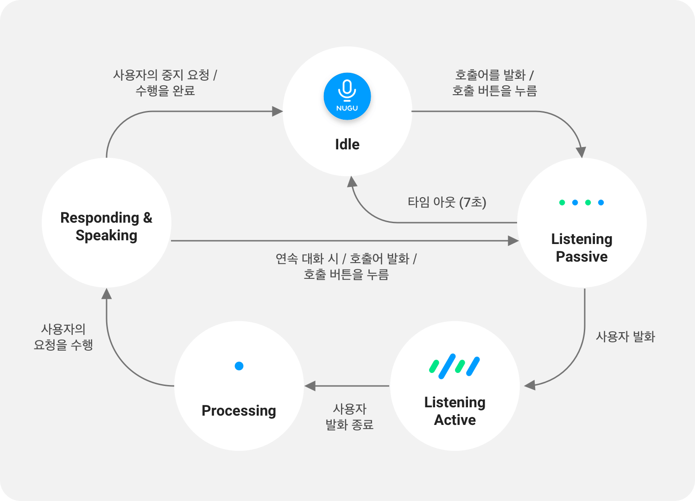

# NUGU 대화 상태

NUGU 대화의 상태는 크게 idle, listening, processing, responding의 4단계로 나눠질 수 있습니다. 먼저 대기상태(idle state)에서 사용자가 호출어(wake-up word)를 발화하거나 호출 버튼을 누르면 NUGU가 사용자의 명령을 받아들일 수 있는 상태(listening-passive)로 변경됩니다. 이때 사용자가 말하기 시작하면 사용자의 발화를 입력 받는 상태(listening-active)로 변경되며, 사용자의 발화가 종료되면 동작을 결정하는 단계(processing)를 거쳐 명령에 대한 답변이나 동작을 수행(responding)하게 됩니다. 각 상태의 기본 흐름은 아래와 같습니다.

각 상태 별 정의는 아래와 같습니다.

| 상태                        | 정의                                                                 |
|:--------------------------|:-------------------------------------------------------------------|
| **Idle**                  | Wake up 가능한 대기 상태                                                  |
| **Listening – Passive**   | 사용자 발화 입력 대기 상태                                                    |
| **Listening – Active**    | 사용자 발화 입력 중 상태                                                     |
| **Processing**            | 입력된 사용자 발화를 분석하는 상태                                                |
| **Responding - Speaking** | 정보나 동작에 대한 TTS를 제공하는 상태                                            |
| **Responding - Playing**  | 콘텐츠를 재생하는 상태                                                       |
| **Responding - Error**    | 발화한 명령에 대한 동작을 수행할 수 없어, 이에 대한 피드백을 제공하는 상태. Speaking 상태 대신 발생 |

사용자가 wake up 시키지 않더라도, NUGU가 스스로 깨어나서 동작을 수행하는 경우가 있는데, 이를 alert 상태라고 하며 아래와 같이 나뉠 수 있습니다.

| Alert 상태            | 정의                                     |
|:--------------------|:---------------------------------------|
| **Alert - Message** | 새로운 알림 메시지가 수신된 상태                     |
| **Alert - Sound**   | 사운드 알림 수신되어 이를 표출중인 상 (알람, 타이머, 전화 수신) |

NUGU의 각 상태에서 호출 버튼을 눌렀을 때의 상태 변화는 다음과 같습니다.

| 현재 상태                                            | 호출 버튼 눌렀을 때의 상태 변화                                                                                                                                                                                                                                          |
|:-------------------------------------------------|:------------------------------------------------------------------------------------------------------------------------------------------------------------------------------------------------------------------------------------------------------------|
| **Listening – Passive**                          | listening 상태가 해제되어 idle 상태로 돌아감                                                                                                                                                                                                                             |
| **Listening – Active**                           | 호출 버튼을 누르기 전까지 입력된 사용자 발화 까지만 입력 받고 processing 상태 진입                                                                                                                                                                                                        |
| **Alert – Message**                              | 수신된 메시지를 Prompt로 제공하는 speaking 상태 진입                                                                                                                                                                                                                        |
| **Alert – Sound**                                | 사운드 재생이 중지되고 listening – passive 상태 진입                                                                                                                                                                                                                      |
| **Responding – speaking** **Responding – error** | Prompt가 중지되고 listening – passive 상태 진입 이후 이어지는 사용자 발화에 대해 Prompt가 아닌 동작(볼륨 조절, 재생, 재시작 등)을 수행하는 경우에는 동작을 먼저 수행한 후, 중지되었던 Prompt를 처음부터 재시작 사용자 발화에 대해 Prompt를 제공하는 경우에는 중지되었던 Prompt는 무시됨. 1음절 발화, 소음, 무음 등 발화 미인식으로 처리된 경우에도 재생중이었던 Prompt는 무시됨 |
| **Responding - Playing**                         | Playing을 일시정하고 listening – passive 상태 진입 이후 이어지는 사용자 발화에 대해 동작이나 Prompt 를 제공한 후, playing 상태로 돌아옴 (1음절 발화, 소음, 무음 등 발화 미인식으로 처리된 경우에도 동일)                                                                                                                |

