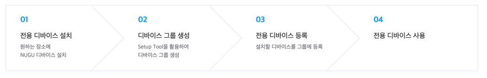
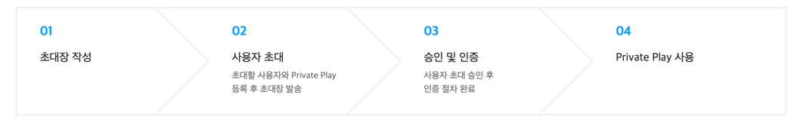

# NUGU biz kit

NUGU biz kit은 NUGU 플랫폼과 연동된 디바이스를 비즈니스 환경에서 활용하기 위한 상품입니다. 비즈니스 용도를 위해 NUGU play kit에서 Private Play를 만들고, 특정 디바이스 또는 사용자 그룹만 사용할 수 있도록 관리 할 수 있습니다. 또한 해당 디바이스 및 사용자를 대상으로 Announcement (tts, image) 메세지를 보낼 수 있습니다.

* [주요 개념](./work-with-nugu-biz/nugu-biz-concept)
* [체험판 및 정식판](./work-with-nugu-biz/describebiz)
* [Private Play](./work-with-nugu-biz/private-play)
* [Biz 전용 디바이스 관리](./work-with-nugu-biz/manage-shared-device)
* [Biz 사용자 관리](./work-with-nugu-biz/manage-enrolled-user)
* [Biz API](./work-with-nugu-biz/biz-api)

## Biz 전용 디바이스 관리(Shared Device)

NUGU 디바이스를 사업장/영업장 등과 같은 공용 공간에서 누구나 사용할 수 있도록 설정하는 기능입니다.

전용 디바이스로 설정되면 NUGU 개인 계정과 연결 없이, 해당 공간을 이용하는 사람은 누구나 이용 가능합니다. 사무 공간, 호텔, 병원 등 다양한 공용 공간에서, 특화된 Private Play를 제공하는 전용 디바이스를 이용할 수 있고, Announcement 메세지를 보낼 수 있습니다.

## Biz 사용자 관리(Enrolled User)

특정 사용자 그룹을 초대하여,  해당 사용자가 보유한 디바이스에서 퍼블리셔가 제공하는 서비스를 이용할 수 있도록 권한을 부여하고 관리하는 기능입니다.

예를 들어, 자사 임직원 또는 단체의 소속 회원만 초대하여, 초대를 수락 회원들의 NUGU 디바이스에서 Private Play를 사용하게 하거나, Announcement 메세지를 수신 할 수 있도록 할 수 있습니다.

