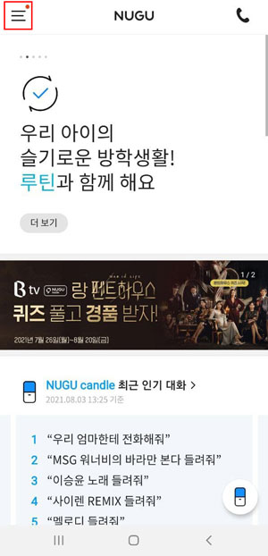

# Biz 사용자 설정 (NUGU APP)

## 1. Biz 사용자 설정

초대받아 등록된 Biz 사용자는, NUGU APP의 Biz 사용자 설정에서 초대 시 등록했던 정보를 수정 하거나, 사용 철회를 할 수 있습니다.

NUGU APP 설정 > 사용자 설정 > Biz 사용자 설정

* NUGU APP의 Biz 사용자 설정 메뉴는, 초대 받아 등록되어 있는 Biz Service나 Play가 존재하는 경우만 노출됩니다.

## 2. Biz 사용자 설정 (체험판)

체험판에서는 Private Play 단위로 초대하여, 해당 Private Play에 대한 사용권한을 사용자에게 부여할 수 있습니다. 초대 받아 등록된 Biz 사용자는, NUGU APP의 Biz 사용자 설정 메뉴에서 Private Play 리스트의 확인과 사용 여부를 변경 할 수 있습니다.

1. Biz 사용자 설정에 진입하면, 해당 유저가 TID 인증을 통해 수락했던 Private Play 목록이 표시됩니다.

   
2. 초대 수락했던 Private Play에 대한 사용 동의 철회가 가능합니다. 동의 철회 즉시, 해당 Play를 사용할 수 없습니다.

   

## 3. Biz 사용자 설정 (정식판)

정식판에서는 유저를 Biz Service 단위로 초대하여 보유한 Play와 Announcement등 Biz API를 발송 할 수 있습니다. 등록된 Biz 사용자는, NUGU APP의 Biz 사용자 설정 메뉴에서 Biz Service의 사용 여부의 변경과, Biz API를 수신 동의 및 수신 받을 기기를 지정, 변경 할 수 있습니다.

1. Biz 사용자 설정에 진입하면, 해당 유저가 TID 인증을 통해 수락했던 Biz Service 목록이 표시됩니다.

   
2. 초대 수락했던 Biz Service에 대한 사용 동의 철회가 가능합니다. 동의 철회 즉시, Biz Service에서 제공 하는 Play를 사용할 수 없고 발송하는 API를 받지 않게 됩니다.

   
3. 초대 시 설정했던 Biz API의 수신 동의와, 수신 대상 디바이스의 설정을 변경할 수 있습니다. Announcement API 발송에 대한 수신을 원치 않거나, 대상 디바이스를 변경하고 싶은 경우 해당 메뉴에서 수정 할 수 있습니다.

   

   
