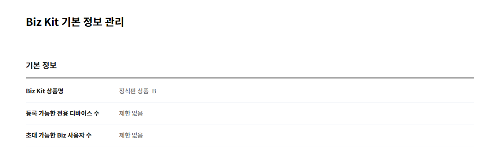
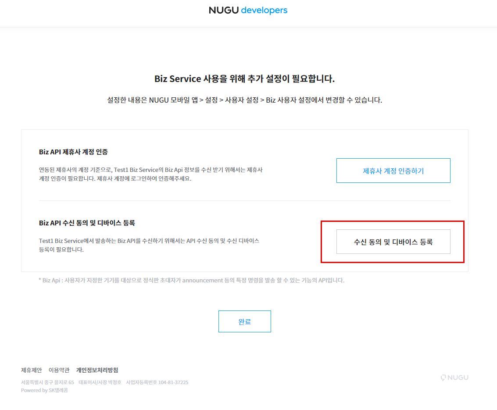

# Biz 사용자 초대 (정식판)

Biz 사용자 관리 정식판에서는 Biz Service 단위로 사용자를 초대하여, 사용자의 승인으로 등록 후 퍼블리셔가 제공하는 Private Play의 사용이 가능하며, Annoucement 메세를 수신 받을 수 있는 대상이 될 수 있습니다.

## 1. Biz Kit 기본 정보 관리

### 기본 정보 조회

현재의 권한 확인이 가능합니다.

### Biz Service 정보 입력

Biz Service로 사용자를 초대하기 위한 기본 정보를 입력합니다. 초대 받는 사용자의 초대장 및 NUGU APP 설정화면에서 표시되는 정보입니다. Biz Service는 Private Play들을 포함하여 퍼블리셔가 제공하는 모든 서비스를 포괄하는 개념으로, Private Play 외 별도로Service 정보입력이 필요합니다.

### Biz API 정보

정식판에 제공되는 Biz API를 사용하기 위한 정보입니다.

* Biz API token : Biz API를 사용할 수 있는 권한을 인증하는 API header 토큰 정보입니다.
* 제휴사 계정 인증 주소 (Optional) : Biz 사용자를 초대 할때, 사용자의 계정 로그인 인증을 할 수 있는 주소를 입력합니다. 해당 주소를 입력하여 사용할 경우, 사용자 초대장에서 계정인증을 할 수 있는 절차가 추가되며, 로그인 인증 시, 해당 제휴사 계정 기반의 사용자의 토큰이 발급되어 Announcement 등의 Biz API에서 활용할 수 있습니다.

## 2. 사용자 그룹 관리

Biz 사용자 관리 > 사용자 그룹 관리에서 초대할 사용자가 소속될 그룹을 생성하고, 관리 할 수 있습니다. 그룹별 Private Play를 구성할 수 있습니다. 그룹이 없는 사용자의 경우 미분류에 해당됩니다.

## 3. 사용자 초대 관리

### 사용자 초대하기

사용자 초대 관리에서 "사용자 초대하기"로 들어가면 초대를 위한 상세 페이지로 이동합니다.

### 사용자 초대 기본정보 입력

* 초대 메일에 표시될 "기본정보"를 입력합니다. 입력된 내용은 "초대장 미리보기"로 확인 가능합니다.

### **사용자 초대 그룹 및 Private Play 지정**

* 그리고 미리 만들어진 "사용자 그룹"을 지정하여 초대하거나, 새로운 사용자 그룹을 만들어 초대하거나, 혹은 "미분류"로 초대 할 수 있습니다.
* 미리 만들어진 그룹으로 초대하는 경우, 해당 그룹의 Private Play가 할당됨으로 별도로 Private Play를 선택하지 않습니다. 미분류나 새로운 그룹을 만들어 초대하는 경우는, 사용할 Private Play를 선택하여 초대합니다.

### 초대자 등록

메일을 수신할 초대자를 웹에서 직접 입력 or 엑셀 파일로 리스트 업로드 하는 방식으로 리스트를 등록 할 수 있습니다.

* 초대자 직접등록

* 초대자 파일로 등록

### 초대장 미리보기

입력한 초대 기본 정보를 포함하여, 수신 대상 초대자에게 보낼 메일의 내용을 미리 확인 할 수 있습니다. 초대장 발송은 미리보기 확인 후 가능합니다.

### 초대장 발송

미리보기 확인을 완료 한 후, "초대장 발송" 버튼을 클릭하면 등록한 사용자에게 이메일로 초대장이 발송됩니다.


이메일로 발송된 초대장의 유효 기간은 72시간입니다. 유효 기간이 경과한 후에는 초대장을 다시 발송해야 합니다.


## 4. 초대장 인증 (사용자 초대 수락)

초대장을 받은 사용자가 Private Play를 사용하려면 NUGU 회원 ID로 로그인 인증이 필요합니다.(NUGU 회원 가입은 [www.nugu.co.kr](http://www.nugu.co.kr) 또는 NUGU App에서 할 수 있습니다.)

사용자는 이메일로 수신된 초대장에서 "여기" 링크를 클릭하여 NUGU ID 인증 페이지로 이동할 수 있으며, 로그인 인증 시점부터 Private Play 이용이 가능합니다. 제공 받은 Private Play의 상세 정보는 NUGU App에서 확인할 수 있습니다.

### Biz Service 추가 정보 등록 (Optional)

정식판 권한의 Biz Service 단위 초대 시에는 해당 기능을 활용하기 위한 추가 정보를 입력할 수 있습니다.

* Biz API 제휴사 계정 인증 : Biz Kit 기본 정보 입력에서, 퍼블리셔가 인증 URL를 등록한 경우 초대장에 활성화 되며, 초대받은 사용자가 해당 계정을 로그인 인증 할 수 있습니다. 인증하는 경우, 인증한 제휴사 게정 기준으로 토큰이 발급되어, Announcement 등의 Biz API 수신 시 활용 될 수 있습니다.

* BIz API 수신 동의 및 디바이스 등록 : 퍼블리셔가 발송하는 Announcement 등 Biz API를 수신 받을 수 있는 디바이스를 사용자가 직접 지정할 수 있습니다. 지정한 디바이스로만 API 발송 사항을 수신하게 됩니다. 등록 완료 이후, NUGU 모바일 앱에서 Biz 사용자 설정에서 변경 할 수 있습니다


Biz API 수신 가능 디바이스는 "[주요개념](../nugu-biz-concept)"의 "NUGU 디바이스(NUGU device)"를 참고해 주세요.


### Biz Service 초대 완료

인증 시점부터 지정된 Private Play 이용이 가능하며, Biz API 수신 받을 수 있습니다. 초대 수락한 정보는 NUGU APP에서 확인 및 수정이 가능합니다.

