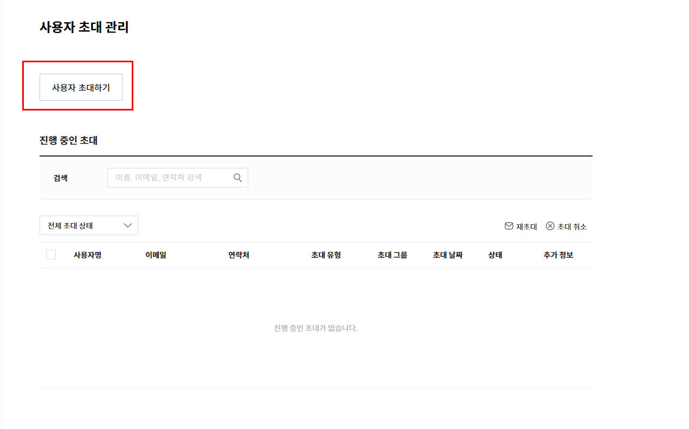
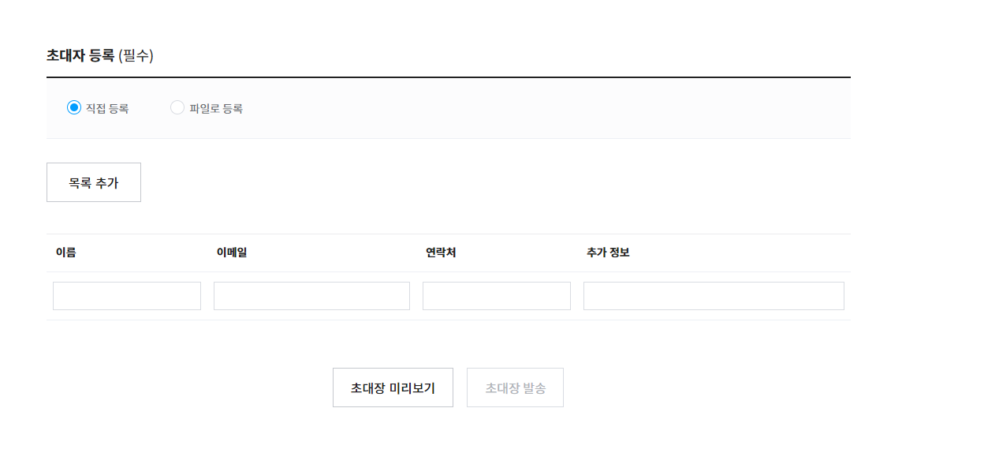
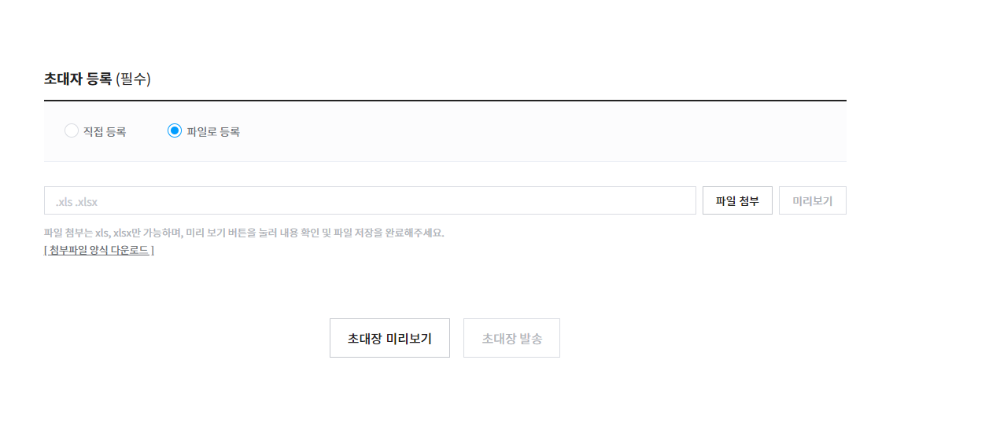
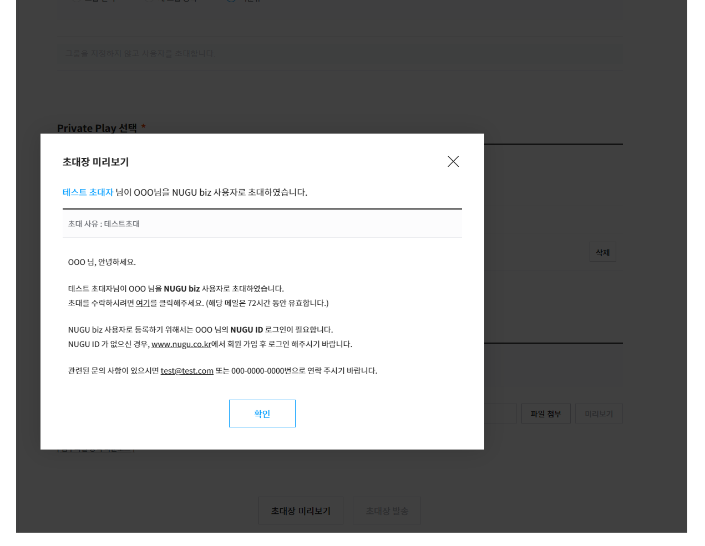
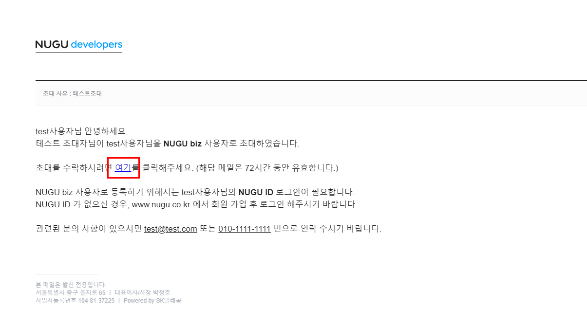

# Biz 사용자 초대 (체험판)

Biz 사용자 관리 체험판에서는 Private Play 단위로 사용자를 초대하여, 사용자의 승인으로 등록 후 Private Play를 사용하도록 할 수 있습니다. 등록 가능한 사용자는 최대 10명으로 제한되어 있습니다.

## 1. Biz Kit 기본 정보 관리

현재의 권한 확인이 가능합니다. 정식판의 경우 Biz Service를 위한 정보, Biz API를 위 제휴사 계정 기반 토큰 생성을 위한 정보 등 더 많은 정보를 활용하여 사용자를 초대할 수 있습니다.

## 2. 사용자 그룹 관리

Biz 사용자 관리 > 사용자 그룹 관리에서 초대할 사용자가 소속될 그룹을 생성하고, 관리 할 수 있습니다. 그룹별 Private Play를 구성할 수 있습니다. 그룹이 없는 사용자의 경우 미분류에 해당됩니다.

## 3. 사용자 초대 관리

### 사용자 초대하기

사용자 초대 관리에서 "사용자 초대하기"로 들어가면 초대를 위한 상세 페이지로 이동합니다.

### 사용자 초대 기본정보 입력

* 초대 메일에 표시될 "기본정보"를 입력합니다. 입력된 내용은 "초대장 미리보기"로 확인 가능합니다.

### **사용자 초대 그룹 및 Private Play 지정**

* 그리고 미리 만들어진 "사용자 그룹"을 지정하여 초대하거나, 새로운 사용자 그룹을 만들어 초대하거나, 혹은 "미분류"로 초대 할 수 있습니다.
* 미리 만들어진 그룹으로 초대하는 경우, 해당 그룹의 Private Play가 할당됨으로 별도로 Private Play를 선택하지 않습니다. 미분류나 새로운 그룹을 만들어 초대하는 경우는, 사용할 Private Play를 선택하여 초대합니다.

### 초대자 등록

메일을 수신할 초대자를 웹에서 직접 입력 or 엑셀 파일로 리스트 업로드 하는 방식으로 리스트를 등록 할 수 있습니다. 체험판은 최대 등록 가능 인원이 10명으로 제한됩니다. (초대 진행 중, 초대완료등록 포함 10명)

* 초대자 직접등록

* 초대자 파일로 등록

### 초대장 미리보기

입력한 초대 기본 정보를 포함하여, 수신 대상 초대자에게 보낼 메일의 내용을 미리 확인 할 수 있습니다. 초대장 발송은 미리보기 확인 후 가능합니다.

### 초대장 발송

미리보기 확인을 완료 한 후, "초대장 발송" 버튼을 클릭하면 등록한 사용자에게 이메일로 초대장이 발송됩니다.


이메일로 발송된 초대장의 유효 기간은 72시간입니다. 유효 기간이 경과한 후에는 초대장을 다시 발송해야 합니다.


## 4. 초대장 인증 (사용자 초대 수락)

초대장을 받은 사용자가 Private Play를 사용하려면 NUGU 회원 ID로 로그인 인증이 필요합니다.(NUGU 회원 가입은 [www.nugu.co.kr](http://www.nugu.co.kr) 또는 NUGU App에서 할 수 있습니다.)

사용자는 이메일로 수신된 초대장에서 "여기" 링크를 클릭하여 NUGU ID 인증 페이지로 이동할 수 있으며, 로그인 인증 시점부터 Private Play 이용이 가능합니다. 제공 받은 Private Play의 상세 정보는 NUGU App에서 확인할 수 있습니다.


이메일마다 하나의 NUGU ID만 인증 할 수 있습니다.

Private Play 사용자는 언제든지 NUGU App에서 Private Play 이용 권한을 해제할 수 있습니다. 해제 시 Private Play 이용 권한이 제거되며, 제된 이후에는 Private Play를 이용할 수 없습니다.

만약, 권한 재부여를 원할 경우에는 서비스 관리자가 NUGU developers를 통해 다시 초대장을 발송해야 합니다.

