# Biz 전용 디바이스 관리

NUGU 디바이스를 사무 공간, 호텔, 병원 등 다양한 공용 공간에서, 공간의 목적에 맞게 사용 가능합니다. NUGU 디바이스 설치 후 전용 디바이스로 등록/설정하면, NUGU 개인 계정과 연결없이 해당 공간에서 누구나 사용 가능합니다.

## 등록 프로세스 

전용 디바이스 기능 사용을 하려면, 먼저 디바이스를 등록해야 합니다.

디바이스 등록은 사전 준비 → 디바이스 그룹 생성 → 디바이스 Setup Tool 설치 → Setup Tool을 통한 디바이스 등록 및 설정 프로세스로 진행합니다.

## 사전 준비 

전용 디바이스의 등록 설정을 위해선, 아래와 같은 사전 준비와 확인이 필요합니다.

**디바이스 전원 켜짐 확인**\
디바이스의 전원이 켜져 있어야 합니다.

**Wi-Fi 연결 환경 확인**\
디바이스 등록 작업을 진행할 PC 또는 노트북에서 Wi-Fi 연결이 가능해야 합니다.

**디바이스 설정 모드(Setup 모드)**\
처음 개봉한 디바이스는 전원을 켜면 자동으로 설정 모드로 진입하기 때문에 별도의 설정 작업을 진행하지 않아도 됩니다. 단, 이미 사용하고 중인 디바이스의 경우, 스피커의 네트워크 진입 모드 버튼을 누르거나 스피커 상단의 음소거 버튼을 길게(7-8초) 눌러 설정 모드로 변경할 수 있습니다.

## 디바이스 그룹 생성 

사전 준비가 끝나면 다음으로 디바이스 그룹을 생성합니다.

\1. `Developers Console` >`Biz kit` > `Biz 전용 디바이스 관리` 메뉴에서 `그룹 생성하기` 버튼을 클릭합니다.

   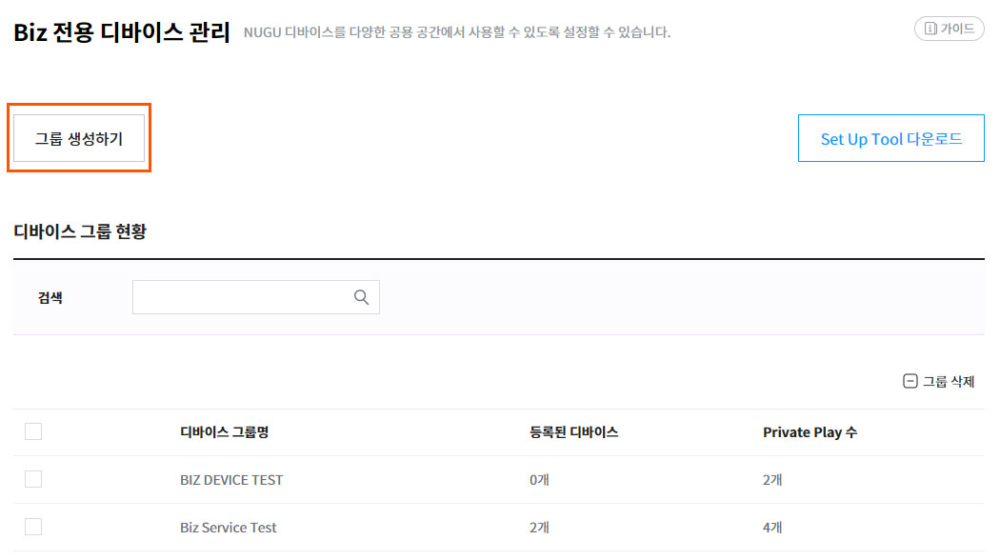
\2. 디바이스 그룹 생성 팝업에서 생성할 디바이스 그룹의 기본 정보(디바이스 그룹명, 디바이스 그룹 설명, 주소)를 입력하고 `생성` 버튼을 클릭하면 그룹이 생성됩니다.
   * 특정 주소 정보가 필요한 서비스(예: 날씨)의 경우, 주소를 등록하면 등록한 주소지를 기준으로 서비스가 제공됩니다.

   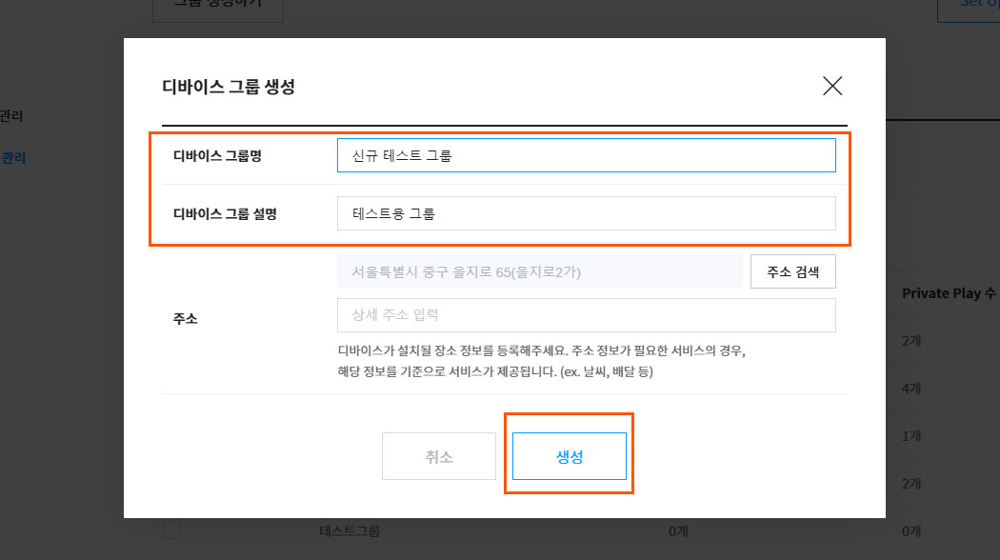

   * 디바이스 그룹 현황 리스트에 생성한 디바이스 그룹이 표시됩니다.

   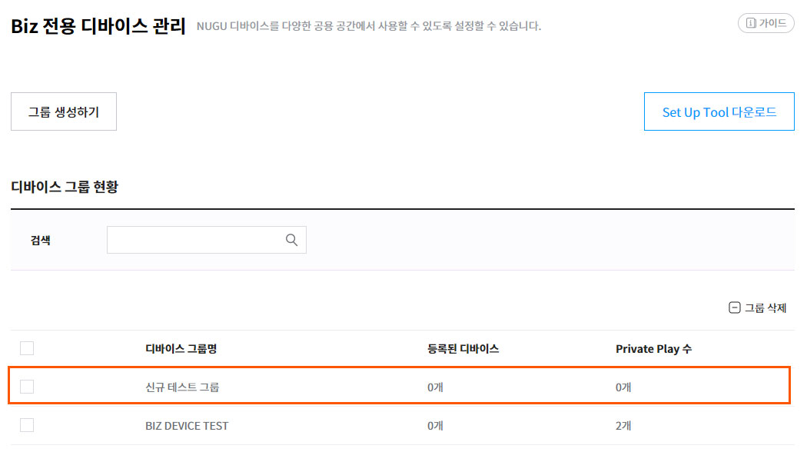

## Setup Tool 설치 및 디바이스 등록 

디바이스 그룹을 생성한 후에는 \[Setup Tool]을 설치하고 사용할 디바이스를 등록합니다.

\1. `Developers Console` >`Biz kit` > `Biz 전용 디바이스 관리` 메뉴에서  `Setup Tool 다운로드` 버튼을 클릭하여 설치 파일을 내려받아 프로그램을 설치합니다.

   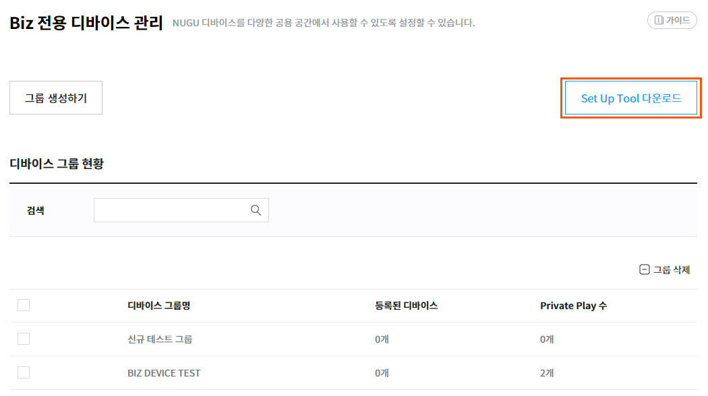


디바이스 Setup Tool은 Window 7 이상에서만 사용할 수 있습니다. Mac에서는 이용할 수 없습니다.


\2. Setup Tool 프로그램을 실행하고, 전용 디바이스를 등록할 디바이스 그룹명을 선택하고 `다음` 버튼을 클릭합니다.

   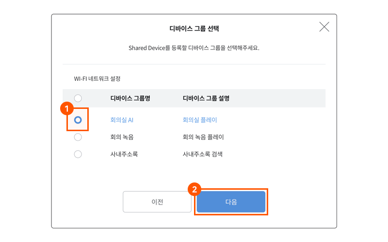

\3. `디바이스 검색` 버튼을 클릭하여 전용 디바이스로 등록할 디바이스를 검색 및 선택한 후 `다음` 버튼을 클릭합니다. 체험판 회원의 경우 10대의 디바이스만 등록이 가능합니다.

   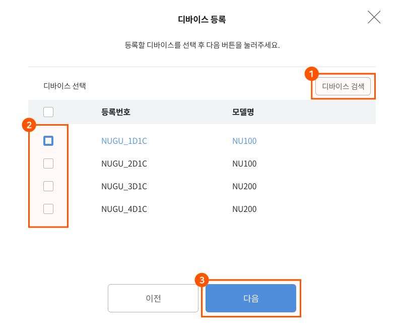


* 디바이스 검색 시 디바이스 등록 번호로 노출이 됩니다. 등록 번호는 스피커 제품 하단에 명시되어 있습니다. 단, NUGU mini(NU200) 디바이스는 “NU-110XXXX”형태의 번호가 등록번호입니다.
* 디바이스가 검색되지 않으면 NUGU 디바이스가 설정 모드로 설정되어 있는지 다시 한번 확인하세요.


\4. `Wi-Fi 검색` 버튼을 클릭하여 전용 디바이스에 등록하려는 Wi-Fi 네트워크를 선택한 후 `다음` 버튼을 클릭하여 네트워크를 설정합니다.

   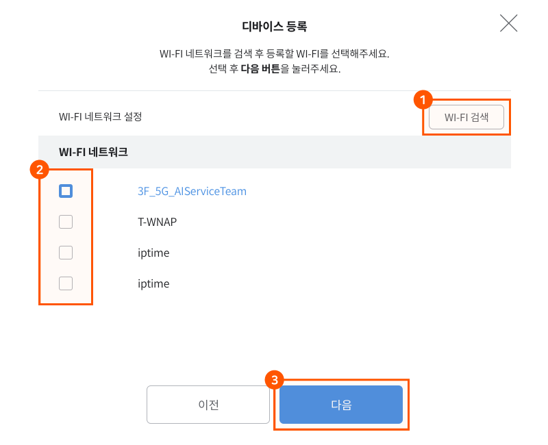

\5. 네트워크 설정을 완료한 후 `다음` 버튼을 클릭하여 NUGU developers에 전용 디바이스로 등록을 요청합니다.

   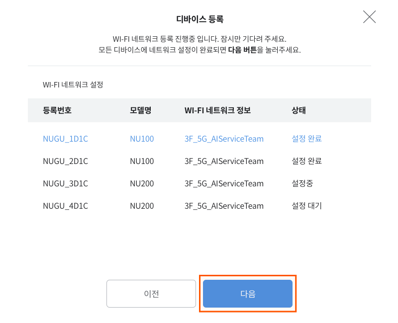


보안 네트워크는 암호를 입력해야 합니다.


\6. 디바이스 상태가 디바이스 등록 완료로 모두 변경되면 `다음` 버튼을 클릭합니다.

   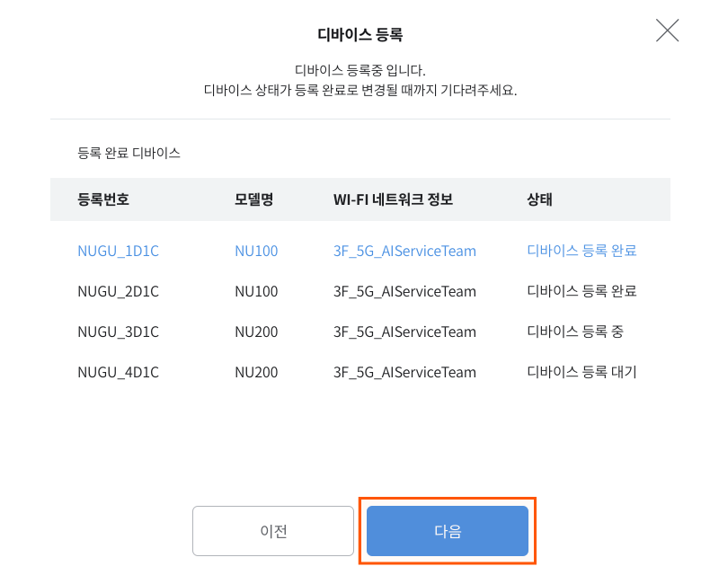

\7. 디바이스 최종 등록 완료 메시지가 표시되면 `확인` 버튼을 클릭하여 작업을 종료합니다.

   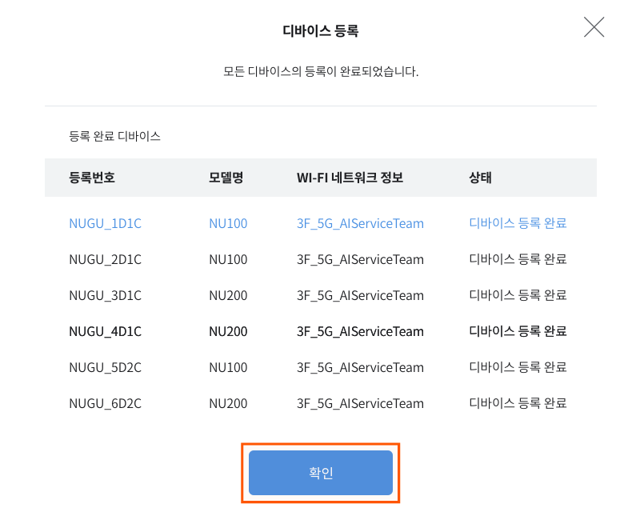


디바이스는 한 번에 최대 25대씩 등록할 수 있습니다. 체험판은 기 등록된 디바이스 포함 총 10대 까지 등록 가능합니다.


## 디바이스 그룹 관리 

이 메뉴에서는 디바이스 그룹 정보를 수정 또는 삭제, 등록된 전용 디바이스 삭제, Private Play 추가 등의 작업을 할 수 있습니다.

### 디바이스 그룹 정보 수정

`Developers Console` >`Biz kit` > `Biz 전용 디바이스 관리` 디바이스 그룹 현황 리스트에서 정보를 수정할 디바이스 그룹명을 클릭하여 선택합니다.

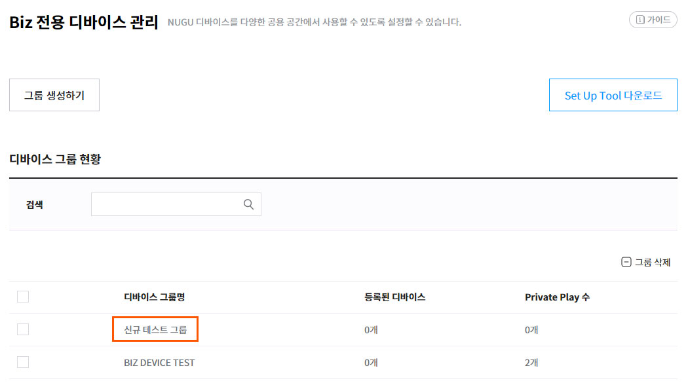

디바이스 그룹 상세 페이지의 기본 정보 항목에 있는 `수정` 버튼을 클릭한 후 그룹명, 그룹설명, 주소 등의 기본 정보를 조회/변경할 수 있습니다. Biz API를 사용하는 정식판 권한의 경우, 추가적으로 API를 보낼 수 있는 디바이스 그룹 token을 확인 할 수 있습니다.

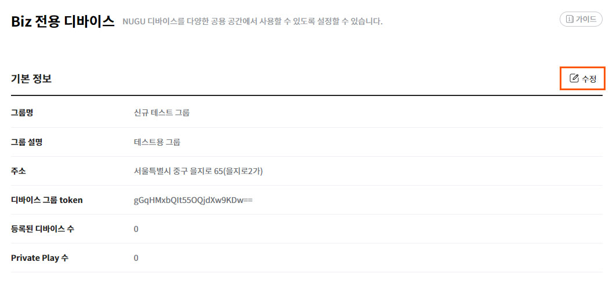

### 등록된 디바이스 삭제

디바이스 그룹 상세 페이지의 등록된 디바이스 항목에서 삭제할 디바이스를 선택한 후 `디바이스 삭제` 버튼을 클릭합니다.

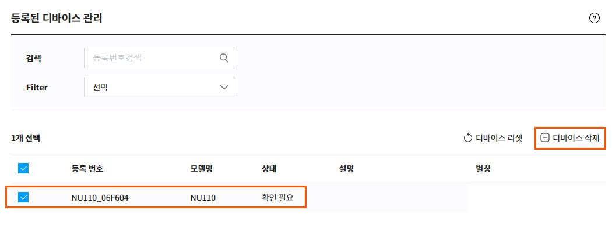


디바이스를 삭제하면 전용 디바이스 등록이 해제됩니다.

해제된 디바이스는 Setup Tool을 통해 전용 디바이스로 재등록할 수 있습니다.


### Private Play 추가/삭제

디바이스 그룹 상세 페이지의 Private Play 항목에서 `Play 추가하기` 버튼을 클릭하여 Private Play 추가할 수 있습니다.

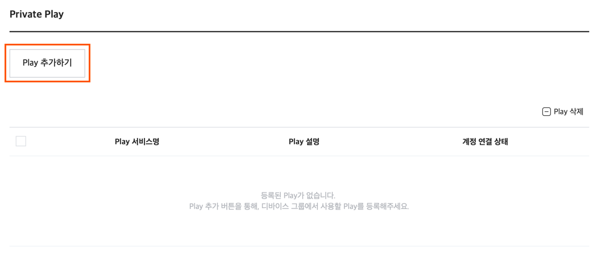

등록한 Private Play를 삭제하려면, 삭제할 Private Play를 선택하고 `- Play 삭제` 버튼을 클릭합니다.

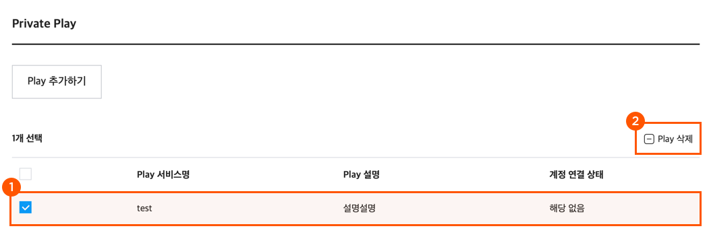

### 디바이스 그룹 삭제

디바이스 그룹을 삭제하려면, 디바이스 그룹 현황 리스트에서 삭제할 디바이스 그룹 선택 후 `디바이스 그룹 삭제` 버튼을 클릭합니다.

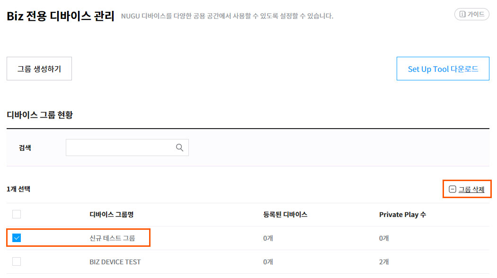


디바이스 그룹을 삭제하면 그룹에 등록된 디바이스의 전용 디바이스 등록이 해제되며, 전용 디바이스 이용이 중지됩니다.


### 사용 제외 Play 설정

정식판 권한의 경우, 전용 디바이스 그룹에서 NUGU에서 기본적으로 제공하는 Play 서비스를 사용할 수 없도록 제외 Play를 지정 할 수 있습니다. `설정하기` 버튼으로 NUGU device의 기본 서비스 Play 목록을 조회합니다.

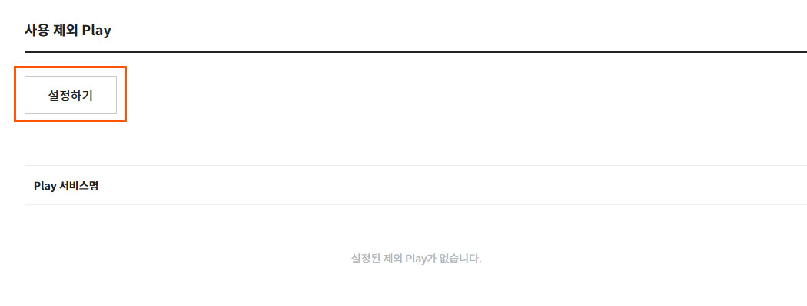

해당 디바이스 그룹에서, 사용하지 못하게 할 특정 서비스 Play를 선택 합니다.

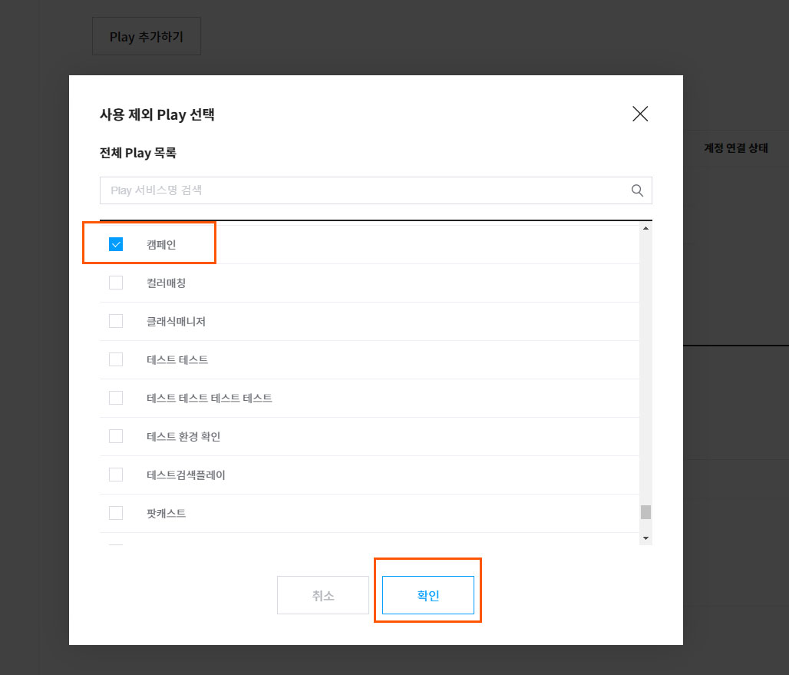

설정이 완료되면, 해당 Play 서비스의 이용 시, 이용 불가능 안내 처리 됩니다.

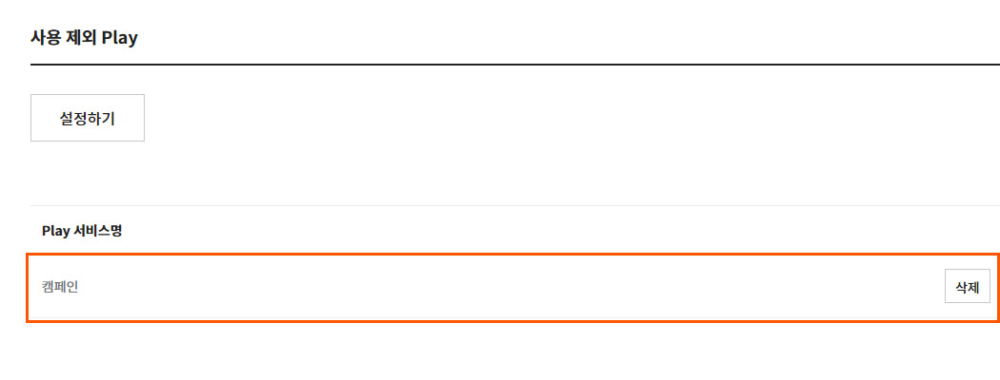

## Biz 전용 디바이스의 서비스 이용 제한 

NUGU 디바이스를 전용 디바이스로 등록하면, 사용 제외 Play 설정과 관계없이 NUGU에서 제공되는 일부 서비스의 이용이 기본적으로 제한됩니다. 제한되는 서비스 항목은 다음과 같습니다.

* 폰찾기
* MY Q&A
* 긴급 SOS
* 도미노 피자
* BBQ 치킨
* 홈픽 택배
* 길찾기
* 오디오 북
* 스마트 홈
* 11번가 쇼핑
* B tv 연동
