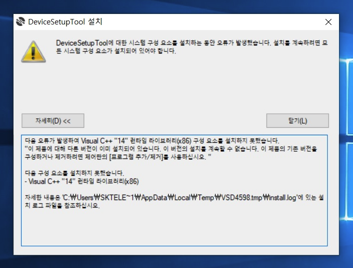
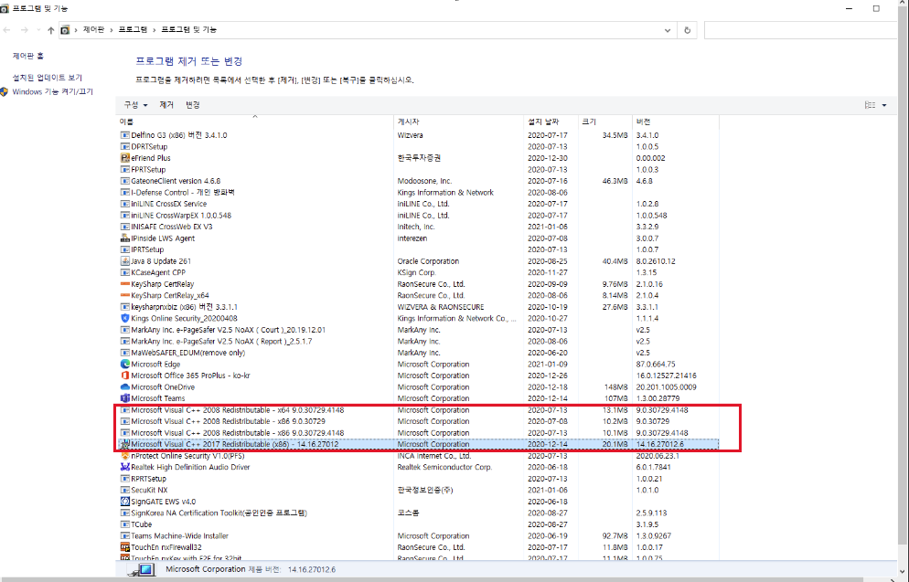

# Visual C++ 런타임라이브러리 (x86) 오류

Device Setup Tool 설치 시 발생하는 Visual C++ 런타임라이브러리 (x86) 관련 오류입니다.

## 오류 증상

설치 중 "Visual C++ 런타임라이브러리(x86) 구성 요소를 설치 하지 못했습니다. "라는 메세지와 함께 Device Setup Tool 설치 실패하게 됩니다.




```text
The following properties have been set:
Property: [AdminUser] = true {boolean}
Property: [InstallMode] = HomeSite {string}
Property: [NTProductType] = 1 {int}
Property: [ProcessorArchitecture] = AMD64 {string}
Property: [VersionNT] = 10.0.0 {version}
Running checks for package 'Microsoft .NET Framework 4.6.1(x86 및 x64)', phase BuildList
Reading value 'Release' of registry key 'HKLM\Software\Microsoft\NET Framework Setup\NDP\v4\Full'
Read integer value 528049
Setting value '528049 {int}' for property 'DotNet461Full_Release'
Reading value 'v4' of registry key 'HKLM\SOFTWARE\Microsoft\NET Framework Setup\OS Integration'
Read integer value 1
Setting value '1 {int}' for property 'DotNet461Full_OSIntegrated'
Reading value 'Release' of registry key 'HKLM\Software\Microsoft\NET Framework Setup\NDP\v4\Full\1042'
Read integer value 528049
Setting value '528049 {int}' for property 'DotNet461FullLangPack_Release'
Reading value 'LCID' of registry key 'HKLM\SYSTEM\CurrentControlSet\Control\MUI\UILanguages\ko-KR'
Read integer value 1042
Setting value '1042 {int}' for property 'DotNet461FullLangPack_OS_LCID'
Reading value 'v4' of registry key 'HKLM\SOFTWARE\Microsoft\NET Framework Setup\OS Integration'
Read integer value 1
Setting value '1 {int}' for property 'DotNet461FullLangPack_OSIntegrated'
The following properties have been set for package 'Microsoft .NET Framework 4.6.1(x86 및x64)'
Property: [DotNet461FullLangPack_OSIntegrated] = 1 {int}
Property: [DotNet461FullLangPack_OS_LCID] = 1042 {int}
Property: [DotNet461FullLangPack_Release] = 528049 {int}
Property: [DotNet461Full_OSIntegrated] = 1 {int}
Property: [DotNet461Full_Release] = 528049 {int}
Running checks for command 'DotNetFX461\NDP461-KB3102436-x86-x64-AllOS-ENU.exe'
Result of running operator 'ValueEqualTo' on property 'InstallMode' and value 'HomeSite': true
Result of checks for command 'DotNetFX461\NDP461-KB3102436-x86-x64-AllOS-ENU.exe' is 'Bypass'
Running checks for command 'DotNetFX461\NDP461-KB3102438-Web.exe'
Result of running operator 'ValueNotEqualTo' on property 'InstallMode' and value 'HomeSite': false
Result of running operator 'ValueGreaterThanEqualTo' on property 'DotNet461Full_Release' and value '394254': true
Result of checks for command 'DotNetFX461\NDP461-KB3102438-Web.exe' is 'Bypass'
Running checks for command 'DotNetFX461\NDP461-KB3102436-x86-x64-AllOS-KOR.exe'
Result of running operator 'ValueGreaterThanEqualTo' on property 'DotNet461FullLangPack_Release' and value '394254': true
Result of checks for command 'DotNetFX461\NDP461-KB3102436-x86-x64-AllOS-KOR.exe' is 'Bypass'
Running checks for command 'DotNetFX461\NDP461-KB3102436-x86-x64-AllOS-KOR.exe'
Result of running operator 'ValueGreaterThanEqualTo' on property 'DotNet461FullLangPack_Release' and value '394254': true
Result of checks for command 'DotNetFX461\NDP461-KB3102436-x86-x64-AllOS-KOR.exe' is 'Bypass'
'Microsoft .NET Framework 4.6.1(x86및 x64)' RunCheck result: No Install Needed
Running checks for package 'Visual C++ "14"런타임라이브러리(x86)', phase BuildList
Running MsiProductCheck with ProductCode '{7B77DE7F-5219-435E-9CE1-FC77F1D4CCAD}'
MsiQueryProductState returned '-1'
Setting value '-1 {int}' for property 'VCRedistInstalled'
The following properties have been set for package 'Visual C++ "14" 런타임라이브러리(x86)':
Property: [VCRedistInstalled] = -1 {int}
Running checks for command 'vcredist_x86\vc_redist.x86.exe'
Result of running operator 'ValueGreaterThanEqualTo' on property 'VCRedistInstalled' and value '3': false
Result of running operator 'ValueEqualTo' on property 'AdminUser' and value 'false': false
Skipping FailIf because Property 'Version9X' was not defined
Result of running operator 'VersionLessThan' on property 'VersionNT' and value '6.00': false
Result of checks for command 'vcredist_x86\vc_redist.x86.exe' is 'Install'
'Visual C++ "14" 런타임라이브러리(x86)' RunCheck result: Install Needed
Installation of components 'Visual C++ "14"런타임라이브러리(x86)' was accepted.
Copying files to temporary directory "C:\Users\SKTELE~1\AppData\Local\Temp\VSD4598.tmp\"
Downloading files to "C:\Users\SKTELE~1\AppData\Local\Temp\VSD4598.tmp\"
(2021-01-12 오후 2:51:40) Downloading 'vcredist_x86\vc_redist.x86.exe' from 'https://aka.ms/vs/15/release/27012.06/VC_Redist.x86.exe' to 'C:\Users\SKTELE~1\AppData\Local\Temp\VSD4598.tmp\'
Download completed at 2021-01-12 오후 2:51:45
Verifying file integrity of C:\Users\SKTELE~1\AppData\Local\Temp\VSD4598.tmp\vcredist_x86\vc_redist.x86.exe
WinVerifyTrust returned 0
File trusted
Running checks for package 'Visual C++ "14"런타임라이브러리(x86)', phase BeforePackage
Running MsiProductCheck with ProductCode '{7B77DE7F-5219-435E-9CE1-FC77F1D4CCAD}'
MsiQueryProductState returned '-1'
Setting value '-1 {int}' for property 'VCRedistInstalled'
The following properties have been set for package 'Visual C++ "14" 런타임라이브러리(x86)':
Property: [VCRedistInstalled] = -1 {int}
Running checks for command 'vcredist_x86\vc_redist.x86.exe'
Result of running operator 'ValueGreaterThanEqualTo' on property 'VCRedistInstalled' and value '3': false
Result of running operator 'ValueEqualTo' on property 'AdminUser' and value 'false': false
Skipping FailIf because Property 'Version9X' was not defined
Result of running operator 'VersionLessThan' on property 'VersionNT' and value '6.00': false
Result of checks for command 'vcredist_x86\vc_redist.x86.exe' is 'Install'
'Visual C++ "14" 런타임라이브러리(x86)' RunCheck result: Install Needed
Verifying file integrity of C:\Users\SKTELE~1\AppData\Local\Temp\VSD4598.tmp\vcredist_x86\vc_redist.x86.exe
WinVerifyTrust returned 0
File trusted
Installing using command 'C:\Users\SKTELE~1\AppData\Local\Temp\VSD4598.tmp\vcredist_x86\vc_redist.x86.exe' and parameters ' /q '
Process exited with code 1638
Status of package 'Visual C++ "14" 런타임라이브러리(x86)' after install is 'InstallFailed
```


## 오류 원인

Clickonce를 통해 배포하면서 의존 라이브러리 체크를 진행하게 되는데, 통합 'Visual C++ "14" 런타임 라이브러리(x86)' 가 설치되어 있는 PC의 경우 설치 되어 있지 않다고 판단하여 "Visual C++ "14" 런타임 라이브러리(x86)" 설치 시도하고, 설치 중 해당 라이브러리 중복으로 인하여 설치 오류가 발생하게 됩니다. (Clickonce의 버그로 보고됨)

## 오류 해결 방안

기존 PC에 설치되어 있는 통합 "Visual C++ Redistributable" 라이브러리를 제거 후, Device Setup Tool 재설치를 하면 정상 설치 완료됩니다.

