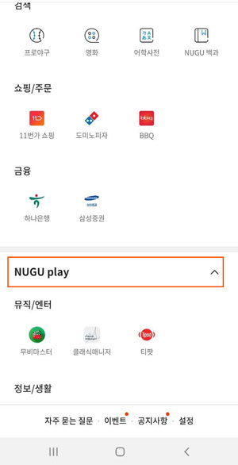
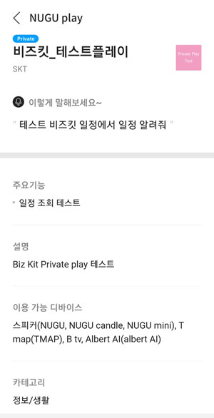

# Private Play

NUGU biz kit의 Biz 전용 디바이스와, 등록된 Biz 사용자(이용 권한을 획득한 사용자)만 이용할 수 있는 Play입니다. Biz 사용자에게 등록된 Private Play는 NUGU App에서 확인할 수 있으며, 일반 사용자에게는 노출되지 않습니다.

## 1. Private Play 등록 하기

Play Builder에서 만든 Play를, NUGU play kit에서 Private Play 속성으 등록 할 수 있습니다. Play 등록 시, Play 공개 유형을 "Private"으로 선택하여 등록하면 됩니다. 자세한 내용은 [Play 정보 등록](../nugu-play/play-registration-and-review/register-a-play) 참고하세요.

## 2. Biz 사용자의 Private play 확인

배포된 Private Play는 Biz 사용자의 NUGU APP 화면에서 다음과 같은 방법으 확인 가능합니다.

#### 1) NUGU APP의 NUGU play 목록에서 확인

* TID 기준으로 등록된 Biz 사용자의 APP화면에 NUGU play 목록을 펼쳐 볼 때 해당 Private Play를 확인 할 수 있습니다. 해당 Private Play는 초대 받아 권한을 받은 사용자에게만 노출됩니다.

* Play를 클릭하여, 해당 Play의 상세정보를 확인 할 수 있습니.

* 해당 Play에 대한 기본적인 정보의 조회가 가능하며, OAuth 계정 연동을 허용한 Play의 경우, "계정 연동" 버튼로 사용자의 계정을 로그인하여 Play를 이용할 수 있습니다. 자세한 내용은 [OAuth 2.0 연동하기](../nugu-play/create-plays-with-play-builder/link-oauth20) 를 참고해주세요.

#### 2) NUGU APP의 Biz 사용자 설정에서 확인

초대받아 등록된 Biz 사용자는, NUGU APP의 Biz 사용자 설정에서 Biz Service 혹은 Private Play를 확인 할 수 있으며, 이용 여부 설정을 변경 할 수 있습니다. 자세한 내용은[ Biz 사용자 설정 (NUGU APP)](./manage-enrolled-user/biz-nugu-app) 을 참고해주세요.
